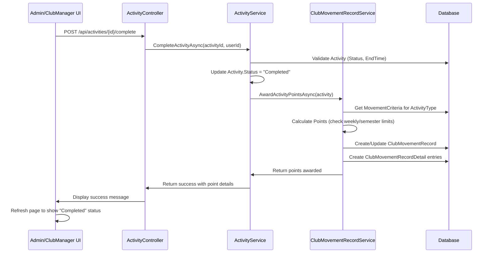

# Design Document

## Overview

This feature adds the ability for Admin and ClubManager users to mark activities as "Completed" after their end time has passed. Upon completion, the system automatically calculates and awards movement points to the organizing club and any collaborating clubs based on predefined scoring criteria. The solution integrates with the existing Activity, ClubMovementRecord, and MovementCriterion systems to provide automated point tracking with proper validation and limits enforcement.

## Architecture

### High-Level Flow



### Component Interaction

1. **UI Layer**: Razor Pages (Admin and ClubManager Details pages)
2. **API Layer**: ActivityController with new endpoint
3. **Service Layer**: ActivityService and ClubMovementRecordService
4. **Repository Layer**: Existing repositories for Activity, ClubMovementRecord, MovementCriterion
5. **Data Layer**: SQL Server database with existing tables

## Components and Interfaces

### 1. UI Components

#### Admin Activities Details Page
**File**: `WebFE/Pages/Activities/Details.cshtml`

**Changes**:
- Add "Complete Activity" button in Quick Actions section
- Button visibility logic: Show when `EndTime < DateTime.Now` AND `Status == "Approved"`
- Hide button when `Status == "Completed"`
- JavaScript function to call API endpoint

#### ClubManager Activities Details Page
**File**: `WebFE/Pages/ClubManager/Activities/Details.cshtml`

**Changes**:
- Add "Complete Activity" button in Quick Actions section (same logic as Admin)
- Only show for activities owned by the manager's club (not collaborated activities)
- JavaScript function to call API endpoint

### 2. API Controller

#### New Endpoint
**File**: `WebAPI/Controllers/AdminActivitiesController.cs` and `WebAPI/Controllers/ClubManagerActivitiesController.cs`

```csharp
[HttpPost("{id}/complete")]
public async Task<IActionResult> CompleteActivity(int id)
{
    var userId = GetCurrentUserId();
    var result = await _activityService.CompleteActivityAsync(id, userId);
    
    if (!result.success)
    {
        return BadRequest(new { message = result.message });
    }
    
    return Ok(new 
    { 
        message = result.message,
        organizingClubPoints = result.organizingClubPoints,
        collaboratingClubPoints = result.collaboratingClubPoints
    });
}
```

### 3. Service Layer

#### ActivityService
**File**: `Services/Activities/ActivityService.cs`

**New Method**:
```csharp
public async Task<(bool success, string message, double organizingClubPoints, double? collaboratingClubPoints)> 
    CompleteActivityAsync(int activityId, int userId)
{
    // 1. Validate activity exists and is approved
    // 2. Validate EndTime has passed
    // 3. Validate not already completed
    // 4. Update Activity.Status to "Completed"
    // 5. Call ClubMovementRecordService to award points
    // 6. Return success with point details
}
```

**Interface Update**:
**File**: `Services/Activities/IActivityService.cs`

```csharp
Task<(bool success, string message, double organizingClubPoints, double? collaboratingClubPoints)> 
    CompleteActivityAsync(int activityId, int userId);
```

#### ClubMovementRecordService (New Service)
**File**: `Services/ClubMovementRecords/ClubMovementRecordService.cs`

**New Methods**:
```csharp
public async Task<(double organizingPoints, double? collaboratingPoints)> 
    AwardActivityPointsAsync(Activity activity)
{
    // 1. Award points to organizing club if ClubId exists
    // 2. Award collaboration points if ClubCollaborationId exists
    // 3. Return points awarded
}

private async Task<double> AwardPointsToClubAsync(
    int clubId, 
    Activity activity, 
    double points, 
    bool isCollaboration)
{
    // 1. Get MovementCriterion for activity type
    // 2. Determine score category based on activity type
    // 3. Check weekly limit for Club Activities
    // 4. Get or create ClubMovementRecord for month/semester
    // 5. Update score category
    // 6. Create ClubMovementRecordDetail
    // 7. Recalculate and cap TotalScore at 100
    // 8. Return actual points awarded
}

private async Task<double> GetWeeklyClubActivityPointsAsync(
    int clubId, 
    int semesterId, 
    DateTime activityEndTime)
{
    // Calculate total ClubMeetingScore for the week containing activityEndTime
}

private string GetScoreCategory(ActivityType activityType)
{
    // Map ActivityType to score category
    // ClubMeeting/Training/Workshop -> ClubMeetingScore
    // LargeEvent/MediumEvent/SmallEvent -> EventScore
    // SchoolCompetition/ProvincialCompetition/NationalCompetition -> CompetitionScore
    // ClubCollaboration/SchoolCollaboration -> CollaborationScore
}
```

**Interface**:
**File**: `Services/ClubMovementRecords/IClubMovementRecordService.cs`

```csharp
public interface IClubMovementRecordService
{
    Task<(double organizingPoints, double? collaboratingPoints)> 
        AwardActivityPointsAsync(Activity activity);
}
```

### 4. Repository Layer

#### ClubMovementRecordRepository
**File**: `Repositories/ClubMovementRecords/ClubMovementRecordRepository.cs`

**New Method**:
```csharp
public async Task<List<ClubMovementRecordDetail>> GetDetailsByClubAndWeekAsync(
    int clubId, 
    int semesterId, 
    DateTime weekStart, 
    DateTime weekEnd)
{
    // Get all details for a club within a specific week
    // Used for weekly limit calculation
}
```

**Interface Update**:
**File**: `Repositories/ClubMovementRecords/IClubMovementRecordRepository.cs`

```csharp
Task<List<ClubMovementRecordDetail>> GetDetailsByClubAndWeekAsync(
    int clubId, 
    int semesterId, 
    DateTime weekStart, 
    DateTime weekEnd);
```

## Data Models

### Existing Models (No Changes Required)

#### Activity
- `Status` field will be updated to "Completed"
- All other fields remain unchanged

#### ClubMovementRecord
- Existing fields will be updated with new points
- `TotalScore` will be recalculated and capped at 100

#### ClubMovementRecordDetail
- New records will be created for each point award
- Links to Activity via `ActivityId`
- Links to MovementCriterion via `CriterionId`

### ActivityType to Score Category Mapping

| ActivityType | Score Category | Max Weekly Points | Notes |
|--------------|----------------|-------------------|-------|
| ClubMeeting | ClubMeetingScore | 5 | Weekly limit enforced |
| ClubTraining | ClubMeetingScore | 5 | Weekly limit enforced |
| ClubWorkshop | ClubMeetingScore | 5 | Weekly limit enforced |
| LargeEvent | EventScore | None | No weekly limit |
| MediumEvent | EventScore | None | No weekly limit |
| SmallEvent | EventScore | None | No weekly limit |
| SchoolCompetition | CompetitionScore | None | No weekly limit |
| ProvincialCompetition | CompetitionScore | None | No weekly limit |
| NationalCompetition | CompetitionScore | None | No weekly limit |
| ClubCollaboration | CollaborationScore | None | No weekly limit |
| SchoolCollaboration | CollaborationScore | None | No weekly limit |

### MovementCriterion Lookup

The system will query `MovementCriterion` table to find the appropriate criterion for each activity type. The lookup will be based on:
- `TargetType = "Club"`
- `DataSource` or `Title` matching the activity type
- `IsActive = true`

If no matching criterion is found, the system will log an error and complete the activity without awarding points.

## Error Handling

### Validation Errors

1. **Activity Not Found**: Return 404 with message "Activity not found"
2. **Activity Not Approved**: Return 400 with message "Activity must be approved before completion"
3. **Activity Not Ended**: Return 400 with message "Activity has not ended yet"
4. **Already Completed**: Return 400 with message "Activity is already completed"
5. **No Club Associated**: Complete activity but don't award points (log warning)
6. **Criterion Not Found**: Complete activity but don't award points (log error)

### Database Errors

1. **Transaction Rollback**: If any database operation fails during point calculation, rollback the entire transaction including the Activity.Status update
2. **Concurrency**: Use database-level locking or optimistic concurrency to prevent duplicate completions
3. **Logging**: Log all errors with activity ID, club ID, and error details for debugging

### User Feedback

1. **Success**: "Activity completed successfully. [Club Name] earned [X] points."
2. **Success with Collaboration**: "Activity completed successfully. [Club Name] earned [X] points. [Collaborating Club] earned [Y] points."
3. **Success with Weekly Limit**: "Activity completed successfully. Weekly limit reached for club activities, no additional points awarded."
4. **Error**: Display specific error message from validation

## Testing Strategy

### Unit Tests

1. **ActivityService.CompleteActivityAsync**
   - Test validation logic (status, end time, already completed)
   - Test successful completion without points (no club)
   - Test successful completion with points
   - Test error handling

2. **ClubMovementRecordService.AwardActivityPointsAsync**
   - Test point calculation for each activity type
   - Test weekly limit enforcement for club activities
   - Test semester limit (100 points cap)
   - Test collaboration point awards
   - Test criterion not found scenario

3. **ClubMovementRecordService.GetWeeklyClubActivityPointsAsync**
   - Test week calculation
   - Test point summation
   - Test edge cases (week boundaries)

### Integration Tests

1. **Complete Activity Flow**
   - Create activity, approve it, set end time to past, complete it
   - Verify Activity.Status updated
   - Verify ClubMovementRecord created/updated
   - Verify ClubMovementRecordDetail created
   - Verify points calculated correctly

2. **Weekly Limit Enforcement**
   - Create multiple club activities in same week
   - Complete them in sequence
   - Verify only 5 points awarded total
   - Verify subsequent activities get 0 points with note

3. **Semester Limit Enforcement**
   - Create activities that would exceed 100 points
   - Complete them in sequence
   - Verify TotalScore capped at 100

4. **Collaboration Points**
   - Create collaboration activity
   - Complete it
   - Verify both clubs receive appropriate points

### Manual Testing

1. **UI Testing**
   - Verify button visibility logic
   - Verify button click triggers API call
   - Verify success message displays
   - Verify page refreshes with updated status

2. **Permission Testing**
   - Verify Admin can complete any activity
   - Verify ClubManager can only complete their club's activities
   - Verify ClubManager cannot complete collaborated activities

3. **Edge Cases**
   - Activity with no club (admin-created public activity)
   - Activity with missing criterion
   - Multiple users trying to complete same activity
   - Network errors during completion

## Design Decisions and Rationales

### 1. Service Layer Separation

**Decision**: Create a separate `ClubMovementRecordService` for point calculation logic.

**Rationale**: 
- Separates concerns: ActivityService handles activity lifecycle, ClubMovementRecordService handles scoring
- Reusable: Point calculation logic can be used by other features (manual scoring, imports, etc.)
- Testable: Easier to unit test scoring logic in isolation

### 2. Transaction Management

**Decision**: Wrap Activity.Status update and point calculation in a single database transaction.

**Rationale**:
- Ensures data consistency: Either both succeed or both fail
- Prevents orphaned completed activities without point records
- Allows rollback on any error

### 3. Weekly Limit Calculation

**Decision**: Calculate week based on Activity.EndTime, using Monday as week start.

**Rationale**:
- Consistent with typical academic week structure
- EndTime is the definitive completion time
- Prevents gaming the system by scheduling activities strategically

### 4. Zero-Point Detail Records

**Decision**: Create ClubMovementRecordDetail records even when 0 points are awarded due to limits.

**Rationale**:
- Provides audit trail of all activities
- Explains why no points were awarded
- Helps clubs understand their scoring history

### 5. Criterion Lookup Strategy

**Decision**: Query MovementCriterion by TargetType="Club" and match on activity type.

**Rationale**:
- Flexible: Allows admins to update point values without code changes
- Consistent: Uses existing criterion system
- Fallback: Can complete activity even if criterion not found (with logging)

### 6. Button Placement

**Decision**: Place "Complete Activity" button in Quick Actions section.

**Rationale**:
- Consistent with existing UI patterns
- Grouped with other management actions
- Clearly visible to authorized users

### 7. Collaboration Point Handling

**Decision**: Award collaboration points separately to collaborating club.

**Rationale**:
- Fair recognition for both clubs
- Separate tracking in ClubMovementRecordDetail
- Allows different point values for organizer vs collaborator

### 8. Semester Limit Enforcement

**Decision**: Cap TotalScore at 100 after each point award, not before.

**Rationale**:
- Simpler calculation: Add points first, then cap
- Consistent behavior: Always cap at 100 regardless of source
- Transparent: Detail records show actual points earned before cap

## Security Considerations

1. **Authorization**: Verify user has permission to complete activity (Admin or ClubManager of organizing club)
2. **Validation**: Validate all inputs and activity state before processing
3. **Audit Trail**: Log all completion attempts with user ID and timestamp
4. **Idempotency**: Prevent duplicate completions through status checks and database constraints
5. **SQL Injection**: Use parameterized queries in all database operations (already handled by EF Core)

## Performance Considerations

1. **Database Queries**: Minimize queries by loading related data in single calls
2. **Indexing**: Ensure indexes exist on:
   - `Activity.Status`
   - `Activity.EndTime`
   - `ClubMovementRecord.ClubId, SemesterId, Month`
   - `ClubMovementRecordDetail.ClubMovementRecordId`
3. **Caching**: Consider caching MovementCriterion data (rarely changes)
4. **Async Operations**: Use async/await throughout to avoid blocking threads

## Future Enhancements

1. **Bulk Completion**: Allow completing multiple activities at once
2. **Scheduled Completion**: Auto-complete activities X hours after end time
3. **Point Adjustment**: Allow admins to manually adjust awarded points
4. **Notification**: Send notifications to club managers when points are awarded
5. **Dashboard**: Show point earning trends and weekly/semester progress
6. **Undo Completion**: Allow admins to undo completion and recalculate points
