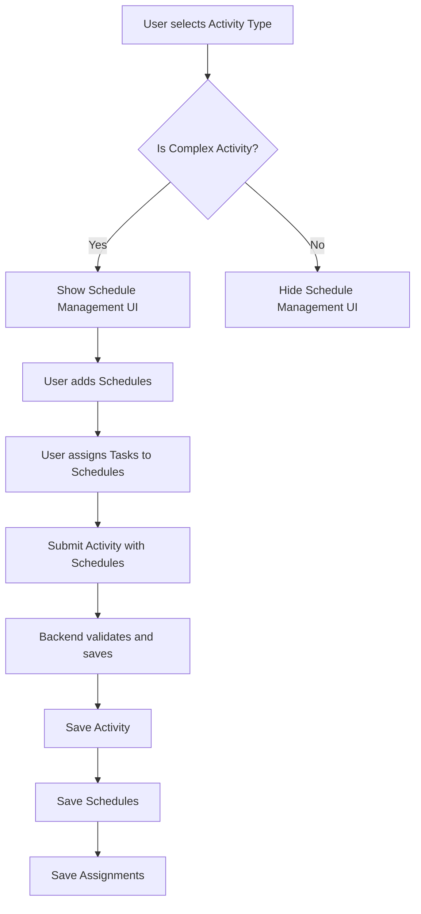

# Design Document

## Overview

Tính năng quản lý lịch trình và phân công công việc cho phép Club Manager và Admin tạo timeline chi tiết cho các hoạt động phức tạp (Events, Competitions, Collaborations). Hệ thống sẽ tự động hiển thị giao diện quản lý lịch trình dựa trên loại hoạt động được chọn, và cho phép phân công nhân sự cho từng mục trong timeline.

## Architecture

### High-Level Flow



### Activity Type Classification

**Complex Activities (có Schedule Management):**
- Events: LargeEvent, MediumEvent, SmallEvent
- Competitions: SchoolCompetition, ProvincialCompetition, NationalCompetition
- Collaborations: ClubCollaboration, SchoolCollaboration

**Club Activities Internal (KHÔNG có Schedule Management):**
- ClubMeeting
- ClubTraining
- ClubWorkshop

## Components and Interfaces

### Frontend Components

#### 1. Schedule Management Section (Create/Edit Pages)

**Location:** `WebFE/Pages/ClubManager/Activities/Create.cshtml` và `Edit.cshtml`

**UI Structure:**
```html
<div id="scheduleManagementSection" style="display: none;">
    <div class="content-card mb-4">
        <div class="content-card-header">
            <h5>Activity Schedule & Task Assignments</h5>
            <button type="button" id="addScheduleBtn" class="btn btn-sm btn-primary">
                <i data-lucide="plus"></i> Add Schedule Item
            </button>
        </div>
        <div class="content-card-body">
            <div id="scheduleList">
                <!-- Schedule items will be dynamically added here -->
            </div>
        </div>
    </div>
</div>
```

**Schedule Item Template:**
```html
<div class="schedule-item card mb-3" data-schedule-index="{index}">
    <div class="card-header">
        <div class="d-flex justify-content-between align-items-center">
            <h6>Schedule Item #{index + 1}</h6>
            <button type="button" class="btn btn-sm btn-outline-danger remove-schedule-btn">
                <i data-lucide="trash-2"></i> Remove
            </button>
        </div>
    </div>
    <div class="card-body">
        <!-- Time inputs -->
        <div class="row g-3 mb-3">
            <div class="col-md-6">
                <label class="form-label">Start Time <span class="text-danger">*</span></label>
                <input type="time" class="form-control schedule-start-time" required />
            </div>
            <div class="col-md-6">
                <label class="form-label">End Time <span class="text-danger">*</span></label>
                <input type="time" class="form-control schedule-end-time" required />
            </div>
        </div>
        
        <!-- Title -->
        <div class="mb-3">
            <label class="form-label">Title <span class="text-danger">*</span></label>
            <input type="text" class="form-control schedule-title" maxlength="500" required />
        </div>
        
        <!-- Description -->
        <div class="mb-3">
            <label class="form-label">Description</label>
            <textarea class="form-control schedule-description" rows="2" maxlength="1000"></textarea>
        </div>
        
        <!-- Notes -->
        <div class="mb-3">
            <label class="form-label">Notes</label>
            <textarea class="form-control schedule-notes" rows="2" maxlength="1000"></textarea>
        </div>
        
        <!-- Task Assignments -->
        <div class="assignments-section">
            <div class="d-flex justify-content-between align-items-center mb-2">
                <label class="form-label mb-0">Task Assignments</label>
                <button type="button" class="btn btn-sm btn-outline-primary add-assignment-btn">
                    <i data-lucide="user-plus"></i> Add Assignment
                </button>
            </div>
            <div class="assignment-list">
                <!-- Assignment items will be added here -->
            </div>
        </div>
    </div>
</div>
```

**Assignment Item Template:**
```html
<div class="assignment-item border rounded p-2 mb-2" data-assignment-index="{index}">
    <div class="row g-2">
        <div class="col-md-5">
            <label class="form-label small">Responsible Person</label>
            <input type="text" class="form-control form-control-sm assignment-name" 
                   placeholder="Name or select user" maxlength="200" />
        </div>
        <div class="col-md-5">
            <label class="form-label small">Role</label>
            <input type="text" class="form-control form-control-sm assignment-role" 
                   placeholder="e.g., MC, Speaker" maxlength="100" />
        </div>
        <div class="col-md-2 d-flex align-items-end">
            <button type="button" class="btn btn-sm btn-outline-danger remove-assignment-btn w-100">
                <i data-lucide="x"></i>
            </button>
        </div>
    </div>
</div>
```

#### 2. Schedule Display Section (Details Page)

**Location:** `WebFE/Pages/ClubManager/Activities/Details.cshtml`

**UI Structure:**
```html
<div id="scheduleDisplaySection" style="display: none;">
    <div class="content-card mb-4">
        <div class="content-card-header">
            <h5>Activity Timeline</h5>
        </div>
        <div class="content-card-body">
            <div class="timeline">
                <!-- Timeline items will be rendered here -->
            </div>
        </div>
    </div>
</div>
```

**Timeline Item Display:**
```html
<div class="timeline-item">
    <div class="timeline-marker"></div>
    <div class="timeline-content">
        <div class="timeline-time">
            <strong>{StartTime} - {EndTime}</strong>
        </div>
        <h6 class="timeline-title">{Title}</h6>
        <p class="timeline-description">{Description}</p>
        <div class="timeline-notes">
            <small class="text-muted">{Notes}</small>
        </div>
        <div class="timeline-assignments">
            <strong>Assigned to:</strong>
            <ul class="list-unstyled">
                <li>{ResponsibleName} - {Role}</li>
            </ul>
        </div>
    </div>
</div>
```

### Backend Components

#### 1. DTOs

**CreateActivityScheduleDto:**
```csharp
public class CreateActivityScheduleDto
{
    [Required]
    public TimeSpan StartTime { get; set; }
    
    [Required]
    public TimeSpan EndTime { get; set; }
    
    [Required, MaxLength(500)]
    public string Title { get; set; } = null!;
    
    [MaxLength(1000)]
    public string? Description { get; set; }
    
    [MaxLength(1000)]
    public string? Notes { get; set; }
    
    public List<CreateActivityScheduleAssignmentDto> Assignments { get; set; } = new();
}
```

**CreateActivityScheduleAssignmentDto:**
```csharp
public class CreateActivityScheduleAssignmentDto
{
    public int? UserId { get; set; }
    
    [MaxLength(200)]
    public string? ResponsibleName { get; set; }
    
    [MaxLength(100)]
    public string? Role { get; set; }
}
```

**UpdateActivityScheduleDto:**
```csharp
public class UpdateActivityScheduleDto
{
    public int? Id { get; set; } // Null for new schedules
    
    [Required]
    public TimeSpan StartTime { get; set; }
    
    [Required]
    public TimeSpan EndTime { get; set; }
    
    [Required, MaxLength(500)]
    public string Title { get; set; } = null!;
    
    [MaxLength(1000)]
    public string? Description { get; set; }
    
    [MaxLength(1000)]
    public string? Notes { get; set; }
    
    public List<UpdateActivityScheduleAssignmentDto> Assignments { get; set; } = new();
}
```

**UpdateActivityScheduleAssignmentDto:**
```csharp
public class UpdateActivityScheduleAssignmentDto
{
    public int? Id { get; set; } // Null for new assignments
    
    public int? UserId { get; set; }
    
    [MaxLength(200)]
    public string? ResponsibleName { get; set; }
    
    [MaxLength(100)]
    public string? Role { get; set; }
}
```

#### 2. Service Methods

**Location:** `Services/Activities/ActivityService.cs`

**New/Modified Methods:**

```csharp
// Helper method to check if activity type requires schedules
private bool IsComplexActivity(ActivityType type)
{
    return type != ActivityType.ClubMeeting && 
           type != ActivityType.ClubTraining && 
           type != ActivityType.ClubWorkshop;
}

// Create activity with schedules
public async Task<Activity> CreateActivityWithSchedulesAsync(
    CreateActivityDto activityDto, 
    List<CreateActivityScheduleDto> schedules, 
    int createdById, 
    int? clubId = null)
{
    // Validate activity type
    if (!IsComplexActivity(activityDto.Type) && schedules.Any())
    {
        throw new InvalidOperationException(
            "Club Activities (Internal) cannot have schedules");
    }
    
    // Create activity
    var activity = await CreateActivityAsync(activityDto, createdById, clubId);
    
    // Add schedules if provided
    if (schedules.Any())
    {
        await AddSchedulesToActivityAsync(activity.Id, schedules);
    }
    
    return activity;
}

// Add schedules to existing activity
public async Task AddSchedulesToActivityAsync(
    int activityId, 
    List<CreateActivityScheduleDto> schedules)
{
    var activity = await _activityRepo.GetByIdAsync(activityId);
    if (activity == null)
    {
        throw new NotFoundException("Activity not found");
    }
    
    // Validate activity type
    if (!IsComplexActivity(activity.Type))
    {
        throw new InvalidOperationException(
            "Club Activities (Internal) cannot have schedules");
    }
    
    // Validate schedule times are within activity time range
    foreach (var scheduleDto in schedules)
    {
        ValidateScheduleTime(scheduleDto, activity);
    }
    
    // Sort schedules by start time
    var sortedSchedules = schedules.OrderBy(s => s.StartTime).ToList();
    
    // Create schedules with order
    for (int i = 0; i < sortedSchedules.Count; i++)
    {
        var scheduleDto = sortedSchedules[i];
        var schedule = new ActivitySchedule
        {
            ActivityId = activityId,
            StartTime = scheduleDto.StartTime,
            EndTime = scheduleDto.EndTime,
            Title = scheduleDto.Title,
            Description = scheduleDto.Description,
            Notes = scheduleDto.Notes,
            Order = i + 1
        };
        
        await _scheduleRepo.AddAsync(schedule);
        
        // Add assignments
        foreach (var assignmentDto in scheduleDto.Assignments)
        {
            ValidateAssignment(assignmentDto);
            
            var assignment = new ActivityScheduleAssignment
            {
                ActivityScheduleId = schedule.Id,
                UserId = assignmentDto.UserId,
                ResponsibleName = assignmentDto.ResponsibleName,
                Role = assignmentDto.Role
            };
            
            await _assignmentRepo.AddAsync(assignment);
        }
    }
}

// Update activity schedules
public async Task UpdateActivitySchedulesAsync(
    int activityId, 
    List<UpdateActivityScheduleDto> schedules)
{
    var activity = await _activityRepo.GetByIdAsync(activityId);
    if (activity == null)
    {
        throw new NotFoundException("Activity not found");
    }
    
    // Validate activity type
    if (!IsComplexActivity(activity.Type))
    {
        throw new InvalidOperationException(
            "Club Activities (Internal) cannot have schedules");
    }
    
    // Get existing schedules
    var existingSchedules = await _scheduleRepo
        .GetByActivityIdAsync(activityId);
    
    // Determine which schedules to delete, update, or add
    var existingIds = existingSchedules.Select(s => s.Id).ToHashSet();
    var updatedIds = schedules
        .Where(s => s.Id.HasValue)
        .Select(s => s.Id!.Value)
        .ToHashSet();
    
    // Delete removed schedules
    var toDelete = existingSchedules
        .Where(s => !updatedIds.Contains(s.Id))
        .ToList();
    
    foreach (var schedule in toDelete)
    {
        await _scheduleRepo.DeleteAsync(schedule.Id);
    }
    
    // Update or add schedules
    var sortedSchedules = schedules.OrderBy(s => s.StartTime).ToList();
    
    for (int i = 0; i < sortedSchedules.Count; i++)
    {
        var scheduleDto = sortedSchedules[i];
        ValidateScheduleTime(scheduleDto, activity);
        
        if (scheduleDto.Id.HasValue)
        {
            // Update existing
            var schedule = existingSchedules
                .First(s => s.Id == scheduleDto.Id.Value);
            
            schedule.StartTime = scheduleDto.StartTime;
            schedule.EndTime = scheduleDto.EndTime;
            schedule.Title = scheduleDto.Title;
            schedule.Description = scheduleDto.Description;
            schedule.Notes = scheduleDto.Notes;
            schedule.Order = i + 1;
            
            await _scheduleRepo.UpdateAsync(schedule);
            
            // Update assignments
            await UpdateScheduleAssignmentsAsync(
                schedule.Id, 
                scheduleDto.Assignments);
        }
        else
        {
            // Add new
            var schedule = new ActivitySchedule
            {
                ActivityId = activityId,
                StartTime = scheduleDto.StartTime,
                EndTime = scheduleDto.EndTime,
                Title = scheduleDto.Title,
                Description = scheduleDto.Description,
                Notes = scheduleDto.Notes,
                Order = i + 1
            };
            
            await _scheduleRepo.AddAsync(schedule);
            
            // Add assignments
            foreach (var assignmentDto in scheduleDto.Assignments)
            {
                ValidateAssignment(assignmentDto);
                
                var assignment = new ActivityScheduleAssignment
                {
                    ActivityScheduleId = schedule.Id,
                    UserId = assignmentDto.UserId,
                    ResponsibleName = assignmentDto.ResponsibleName,
                    Role = assignmentDto.Role
                };
                
                await _assignmentRepo.AddAsync(assignment);
            }
        }
    }
}

// Update schedule assignments
private async Task UpdateScheduleAssignmentsAsync(
    int scheduleId, 
    List<UpdateActivityScheduleAssignmentDto> assignments)
{
    // Get existing assignments
    var existingAssignments = await _assignmentRepo
        .GetByScheduleIdAsync(scheduleId);
    
    var existingIds = existingAssignments.Select(a => a.Id).ToHashSet();
    var updatedIds = assignments
        .Where(a => a.Id.HasValue)
        .Select(a => a.Id!.Value)
        .ToHashSet();
    
    // Delete removed assignments
    var toDelete = existingAssignments
        .Where(a => !updatedIds.Contains(a.Id))
        .ToList();
    
    foreach (var assignment in toDelete)
    {
        await _assignmentRepo.DeleteAsync(assignment.Id);
    }
    
    // Update or add assignments
    foreach (var assignmentDto in assignments)
    {
        ValidateAssignment(assignmentDto);
        
        if (assignmentDto.Id.HasValue)
        {
            // Update existing
            var assignment = existingAssignments
                .First(a => a.Id == assignmentDto.Id.Value);
            
            assignment.UserId = assignmentDto.UserId;
            assignment.ResponsibleName = assignmentDto.ResponsibleName;
            assignment.Role = assignmentDto.Role;
            
            await _assignmentRepo.UpdateAsync(assignment);
        }
        else
        {
            // Add new
            var assignment = new ActivityScheduleAssignment
            {
                ActivityScheduleId = scheduleId,
                UserId = assignmentDto.UserId,
                ResponsibleName = assignmentDto.ResponsibleName,
                Role = assignmentDto.Role
            };
            
            await _assignmentRepo.AddAsync(assignment);
        }
    }
}

// Validation helpers
private void ValidateScheduleTime(
    dynamic scheduleDto, 
    Activity activity)
{
    if (scheduleDto.EndTime <= scheduleDto.StartTime)
    {
        throw new ValidationException(
            "Schedule end time must be after start time");
    }
    
    // Note: TimeSpan comparison with DateTime requires conversion
    // This is a simplified check - actual implementation may need
    // to combine activity date with schedule time
}

private void ValidateAssignment(dynamic assignmentDto)
{
    if (!assignmentDto.UserId.HasValue && 
        string.IsNullOrWhiteSpace(assignmentDto.ResponsibleName))
    {
        throw new ValidationException(
            "Assignment must have either UserId or ResponsibleName");
    }
}
```

#### 3. Repository Methods

**Location:** `Repositories/ActivitySchedules/ActivityScheduleRepository.cs` (new)

```csharp
public interface IActivityScheduleRepository
{
    Task<ActivitySchedule> GetByIdAsync(int id);
    Task<List<ActivitySchedule>> GetByActivityIdAsync(int activityId);
    Task<ActivitySchedule> AddAsync(ActivitySchedule schedule);
    Task UpdateAsync(ActivitySchedule schedule);
    Task DeleteAsync(int id);
}
```

**Location:** `Repositories/ActivityScheduleAssignments/ActivityScheduleAssignmentRepository.cs` (new)

```csharp
public interface IActivityScheduleAssignmentRepository
{
    Task<ActivityScheduleAssignment> GetByIdAsync(int id);
    Task<List<ActivityScheduleAssignment>> GetByScheduleIdAsync(int scheduleId);
    Task<ActivityScheduleAssignment> AddAsync(ActivityScheduleAssignment assignment);
    Task UpdateAsync(ActivityScheduleAssignment assignment);
    Task DeleteAsync(int id);
}
```

#### 4. API Endpoints

**Location:** `WebAPI/Controllers/ActivityController.cs`

**New/Modified Endpoints:**

```csharp
// Create activity with schedules (Club Manager)
[HttpPost("club-manager")]
public async Task<IActionResult> CreateActivityWithSchedules(
    [FromQuery] int clubId,
    [FromBody] CreateActivityWithSchedulesRequest request)
{
    // Validate and create activity with schedules
    var activity = await _activityService.CreateActivityWithSchedulesAsync(
        request.Activity,
        request.Schedules,
        userId,
        clubId
    );
    
    return Ok(activity);
}

// Update activity with schedules (Club Manager)
[HttpPut("club-manager/{id}")]
public async Task<IActionResult> UpdateActivityWithSchedules(
    int id,
    [FromBody] UpdateActivityWithSchedulesRequest request)
{
    // Update activity
    await _activityService.UpdateActivityAsync(id, request.Activity);
    
    // Update schedules
    await _activityService.UpdateActivitySchedulesAsync(id, request.Schedules);
    
    return Ok();
}

// Get activity with schedules
[HttpGet("{id}")]
public async Task<IActionResult> GetActivityDetail(int id)
{
    var activity = await _activityService.GetActivityDetailAsync(id);
    
    // Include schedules and assignments for complex activities
    if (IsComplexActivity(activity.Type))
    {
        activity.Schedules = await _activityService
            .GetActivitySchedulesAsync(id);
    }
    
    return Ok(activity);
}
```

## Data Models

### Existing Models (No Changes Needed)

- **Activity**: Already has `ICollection<ActivitySchedule> Schedules`
- **ActivitySchedule**: Already has all required fields and `ICollection<ActivityScheduleAssignment> Assignments`
- **ActivityScheduleAssignment**: Already has all required fields

### Database Schema

No migration needed - tables already exist:
- `ActivitySchedules`
- `ActivityScheduleAssignments`

## Error Handling

### Validation Errors

1. **Schedule Time Validation:**
   - EndTime <= StartTime → "End time must be after start time"
   - Schedule time outside Activity time range → "Schedule must be within activity time range"

2. **Required Field Validation:**
   - Missing Title → "Schedule title is required"
   - Missing StartTime/EndTime → "Schedule time is required"

3. **Assignment Validation:**
   - No UserId and no ResponsibleName → "Assignment must have a responsible person"

4. **Activity Type Validation:**
   - Adding schedules to Club Activities → "Club Activities (Internal) cannot have schedules"

### Error Response Format

```json
{
  "error": "Validation failed",
  "details": [
    {
      "field": "Schedules[0].EndTime",
      "message": "End time must be after start time"
    }
  ]
}
```

## Testing Strategy

### Unit Tests

1. **Service Layer Tests:**
   - Test `IsComplexActivity()` method
   - Test schedule creation with valid data
   - Test schedule validation (time ranges, required fields)
   - Test assignment validation
   - Test schedule update (add, update, delete)
   - Test error cases (invalid activity type, invalid times)

2. **Repository Layer Tests:**
   - Test CRUD operations for ActivitySchedule
   - Test CRUD operations for ActivityScheduleAssignment
   - Test cascade delete (deleting schedule deletes assignments)

### Integration Tests

1. **API Endpoint Tests:**
   - Test creating activity with schedules
   - Test updating activity with schedules
   - Test getting activity with schedules
   - Test validation errors are returned correctly

2. **Frontend Tests:**
   - Test schedule UI shows/hides based on activity type
   - Test adding/removing schedule items
   - Test adding/removing assignments
   - Test form validation
   - Test data submission

### Manual Testing Checklist

1. **Create Activity Flow:**
   - Select Complex Activity type → Schedule UI appears
   - Select Club Activity type → Schedule UI hidden
   - Add multiple schedules → Sorted by time
   - Add assignments to schedules → Saved correctly
   - Submit form → Activity and schedules created

2. **Edit Activity Flow:**
   - Load activity with schedules → Schedules displayed
   - Add new schedule → Saved correctly
   - Edit existing schedule → Updated correctly
   - Delete schedule → Removed with assignments
   - Change activity type to Club Activity → Schedules removed

3. **View Activity Flow:**
   - View Complex Activity → Timeline displayed
   - View Club Activity → No timeline section
   - Timeline sorted by time → Correct order
   - Assignments displayed → Correct names and roles

## UI/UX Considerations

### Visual Design

1. **Timeline Display:**
   - Use vertical timeline with markers
   - Color-code different schedule items
   - Show time prominently
   - Collapse/expand details

2. **Schedule Management:**
   - Drag-and-drop to reorder (future enhancement)
   - Inline editing for quick updates
   - Clear visual hierarchy
   - Responsive design for mobile

### User Experience

1. **Progressive Disclosure:**
   - Hide schedule section for Club Activities
   - Show schedule section only when needed
   - Collapse assignments by default

2. **Validation Feedback:**
   - Real-time validation as user types
   - Clear error messages
   - Highlight invalid fields
   - Prevent form submission with errors

3. **Data Entry Efficiency:**
   - Auto-sort schedules by time
   - Quick add buttons
   - Keyboard shortcuts
   - Copy/paste schedule items (future enhancement)

## Performance Considerations

1. **Database Queries:**
   - Eager load schedules and assignments when fetching activity details
   - Use pagination for activities with many schedules
   - Index on ActivityId in ActivitySchedules table
   - Index on ActivityScheduleId in ActivityScheduleAssignments table

2. **Frontend Performance:**
   - Lazy load schedule UI components
   - Debounce validation checks
   - Minimize DOM manipulations
   - Use virtual scrolling for large schedule lists (future enhancement)

## Security Considerations

1. **Authorization:**
   - Only Club Manager can manage schedules for their club's activities
   - Only Admin can manage schedules for all activities
   - Validate user permissions before allowing schedule operations

2. **Input Validation:**
   - Sanitize all text inputs
   - Validate time ranges
   - Limit number of schedules per activity (e.g., max 50)
   - Limit number of assignments per schedule (e.g., max 20)

3. **Data Integrity:**
   - Use transactions when creating/updating activity with schedules
   - Cascade delete schedules when activity is deleted
   - Cascade delete assignments when schedule is deleted
