# Design Document - Chatbot Rich Recommendations UI

## Overview

This design enhances the existing AI chatbot system to provide visually rich, structured recommendations through beautiful card-based UI components. The solution involves three main layers:

1. **Backend Enhancement**: Modify the Gemini AI prompt engineering to request structured JSON responses
2. **Response Processing**: Add parsing logic to handle structured recommendation data
3. **Frontend Enhancement**: Create new UI components to render recommendation cards with rich visual elements

The design maintains backward compatibility with existing plain-text responses while adding support for structured recommendation cards.

## Architecture

### High-Level Architecture

```
┌─────────────────────────────────────────────────────────────┐
│                     Frontend (chatbot.js)                    │
│  ┌────────────────┐  ┌──────────────────────────────────┐  │
│  │ Message Parser │→ │ Recommendation Card Renderer     │  │
│  │ - Detect type  │  │ - Card component                 │  │
│  │ - Extract data │  │ - Icon mapping                   │  │
│  └────────────────┘  │ - Score visualization            │  │
│                      └──────────────────────────────────┘  │
└─────────────────────────────────────────────────────────────┘
                              ↕ HTTP
┌─────────────────────────────────────────────────────────────┐
│              Backend (ChatbotService + GeminiAI)             │
│  ┌────────────────┐  ┌──────────────────────────────────┐  │
│  │ Prompt Builder │→ │ Response Parser                  │  │
│  │ - JSON schema  │  │ - JSON validation                │  │
│  │ - Examples     │  │ - Fallback extraction            │  │
│  └────────────────┘  └──────────────────────────────────┘  │
└─────────────────────────────────────────────────────────────┘
                              ↕ HTTP
┌─────────────────────────────────────────────────────────────┐
│                      Gemini AI API                           │
│              (Returns structured JSON responses)             │
└─────────────────────────────────────────────────────────────┘
```

### Component Interaction Flow

```mermaid
sequenceDiagram
    participant Student
    participant Frontend
    participant Backend
    participant GeminiAI
    
    Student->>Frontend: "Tìm câu lạc bộ về công nghệ"
    Frontend->>Frontend: Show typing indicator
    Frontend->>Backend: POST /api/chatbot/message
    Backend->>Backend: Build enhanced prompt with JSON schema
    Backend->>GeminiAI: Generate content with structured prompt
    GeminiAI->>Backend: JSON response with recommendations
    Backend->>Backend: Parse & validate JSON
    Backend->>Frontend: ChatResponseDto with structured data
    Frontend->>Frontend: Detect recommendation format
    Frontend->>Frontend: Render recommendation cards
    Frontend->>Student: Display beautiful cards with scores
```



## Components and Interfaces

### Backend Components

#### 1. Enhanced Prompt Builder (ChatbotService)

**Purpose**: Construct prompts that instruct Gemini AI to return structured JSON responses

**New Method**: `BuildStructuredPrompt()`

```csharp
private string BuildStructuredPrompt(
    StudentContext context, 
    List<ClubRecommendation> clubs,
    List<ActivityRecommendation> activities,
    string userMessage)
{
    var prompt = new StringBuilder();
    
    // System instructions for structured output
    prompt.AppendLine("BẠN LÀ TRỢ LÝ AI HỖ TRỢ SINH VIÊN TÌM CÂU LẠC BỘ VÀ HOẠT ĐỘNG.");
    prompt.AppendLine();
    prompt.AppendLine("QUAN TRỌNG: Khi đề xuất câu lạc bộ hoặc hoạt động, bạn PHẢI trả về JSON theo format sau:");
    prompt.AppendLine();
    prompt.AppendLine("```json");
    prompt.AppendLine("{");
    prompt.AppendLine("  \"message\": \"Văn bản giới thiệu ngắn gọn\",");
    prompt.AppendLine("  \"recommendations\": [");
    prompt.AppendLine("    {");
    prompt.AppendLine("      \"id\": 123,");
    prompt.AppendLine("      \"name\": \"Tên câu lạc bộ\",");
    prompt.AppendLine("      \"type\": \"club\" hoặc \"activity\",");
    prompt.AppendLine("      \"description\": \"Mô tả ngắn\",");
    prompt.AppendLine("      \"reason\": \"Lý do phù hợp với sinh viên\",");
    prompt.AppendLine("      \"relevanceScore\": 95");
    prompt.AppendLine("    }");
    prompt.AppendLine("  ]");
    prompt.AppendLine("}");
    prompt.AppendLine("```");
    prompt.AppendLine();
    
    // Student context
    prompt.AppendLine($"THÔNG TIN SINH VIÊN:");
    prompt.AppendLine($"- Họ tên: {context.FullName}");
    prompt.AppendLine($"- Chuyên ngành: {context.MajorName}");
    prompt.AppendLine($"- Khóa: {context.Cohort}");
    
    // Available clubs
    prompt.AppendLine();
    prompt.AppendLine("CÁC CÂU LẠC BỘ ĐANG MỞ TUYỂN:");
    foreach (var club in clubs)
    {
        prompt.AppendLine($"- ID: {club.ClubId}, Tên: {club.Name}, Danh mục: {club.CategoryName}");
    }
    
    // User message
    prompt.AppendLine();
    prompt.AppendLine($"CÂU HỎI: {userMessage}");
    
    return prompt.ToString();
}
```

#### 2. Response Parser (ChatbotService)

**Purpose**: Parse and validate structured JSON responses from Gemini AI

**New Class**: `StructuredResponse`

```csharp
public class StructuredResponse
{
    public string Message { get; set; }
    public List<RecommendationItem> Recommendations { get; set; }
}

public class RecommendationItem
{
    public int Id { get; set; }
    public string Name { get; set; }
    public string Type { get; set; } // "club" or "activity"
    public string Description { get; set; }
    public string Reason { get; set; }
    public int RelevanceScore { get; set; } // 0-100
}
```

**New Method**: `ParseStructuredResponse()`

```csharp
private (bool isStructured, StructuredResponse? data, string plainText) 
    ParseStructuredResponse(string aiResponse)
{
    try
    {
        // Try to extract JSON from markdown code blocks
        var jsonMatch = Regex.Match(aiResponse, @"```json\s*(\{.*?\})\s*```", 
            RegexOptions.Singleline);
        
        string jsonContent = jsonMatch.Success 
            ? jsonMatch.Groups[1].Value 
            : aiResponse;
        
        // Try to parse as JSON
        var structured = JsonSerializer.Deserialize<StructuredResponse>(
            jsonContent, 
            new JsonSerializerOptions { PropertyNameCaseInsensitive = true }
        );
        
        // Validate structure
        if (structured?.Recommendations != null && structured.Recommendations.Any())
        {
            return (true, structured, string.Empty);
        }
    }
    catch (JsonException ex)
    {
        _logger.LogWarning("Failed to parse structured response: {Error}", ex.Message);
    }
    
    // Fallback to plain text
    return (false, null, aiResponse);
}
```

#### 3. Enhanced ChatResponseDto

**Purpose**: Support both plain text and structured recommendations in API response

```csharp
public class ChatResponseDto
{
    public string Message { get; set; }
    public int SessionId { get; set; }
    public DateTime Timestamp { get; set; }
    public bool Success { get; set; }
    public string? ErrorMessage { get; set; }
    
    // NEW: Structured recommendations
    public bool HasRecommendations { get; set; }
    public List<RecommendationDto>? Recommendations { get; set; }
}

public class RecommendationDto
{
    public int Id { get; set; }
    public string Name { get; set; }
    public string Type { get; set; } // "club" or "activity"
    public string Description { get; set; }
    public string Reason { get; set; }
    public int RelevanceScore { get; set; }
}
```

### Frontend Components

#### 1. Message Type Detector (chatbot.js)

**Purpose**: Detect if a response contains structured recommendations

```javascript
function detectMessageType(response) {
    if (response.hasRecommendations && 
        response.recommendations && 
        response.recommendations.length > 0) {
        return 'recommendations';
    }
    return 'text';
}
```

#### 2. Recommendation Card Renderer (chatbot.js)

**Purpose**: Render beautiful recommendation cards

```javascript
function renderRecommendationCard(recommendation) {
    const typeIcon = recommendation.type === 'club' ? '👥' : '🎯';
    const scoreColor = getScoreColor(recommendation.relevanceScore);
    
    return `
        <div class="recommendation-card" 
             data-id="${recommendation.id}" 
             data-type="${recommendation.type}"
             onclick="navigateToDetail(${recommendation.id}, '${recommendation.type}')">
            <div class="card-header">
                <span class="card-type-icon">${typeIcon}</span>
                <span class="card-type-label">${recommendation.type.toUpperCase()}</span>
            </div>
            <h3 class="card-title">${recommendation.name}</h3>
            ${recommendation.description ? 
                `<p class="card-description">${recommendation.description}</p>` : ''}
            <div class="card-reason">
                <span class="reason-icon">💡</span>
                <p class="reason-text">${recommendation.reason}</p>
            </div>
            <div class="card-score">
                <span class="score-icon">✨</span>
                <span class="score-text" style="color: ${scoreColor}">
                    Độ phù hợp: ${recommendation.relevanceScore}%
                </span>
            </div>
        </div>
    `;
}

function getScoreColor(score) {
    if (score >= 90) return '#00A86B'; // Dark green
    if (score >= 70) return '#32CD32'; // Medium green
    if (score >= 50) return '#FFD700'; // Yellow
    return '#FF8C00'; // Orange
}
```

#### 3. Message Display Handler (chatbot.js)

**Purpose**: Display messages with appropriate format

```javascript
function displayMessage(role, content, response = null) {
    const messageDiv = document.createElement('div');
    messageDiv.className = `chat-message ${role}-message`;
    
    if (role === 'assistant' && response) {
        const messageType = detectMessageType(response);
        
        if (messageType === 'recommendations') {
            // Display intro text if present
            if (response.message) {
                messageDiv.innerHTML += `
                    <div class="message-text">${response.message}</div>
                `;
            }
            
            // Display recommendation cards
            const cardsContainer = document.createElement('div');
            cardsContainer.className = 'recommendations-container';
            
            response.recommendations.forEach(rec => {
                cardsContainer.innerHTML += renderRecommendationCard(rec);
            });
            
            messageDiv.appendChild(cardsContainer);
        } else {
            // Plain text message
            messageDiv.innerHTML = `<div class="message-text">${content}</div>`;
        }
    } else {
        // User message
        messageDiv.innerHTML = `<div class="message-text">${content}</div>`;
    }
    
    chatHistory.appendChild(messageDiv);
    scrollToBottom();
}
```

## Data Models

### Backend Models

```csharp
// Services/Chatbot/Models/StructuredResponse.cs
public class StructuredResponse
{
    public string Message { get; set; } = string.Empty;
    public List<RecommendationItem> Recommendations { get; set; } = new();
}

// Services/Chatbot/Models/RecommendationItem.cs
public class RecommendationItem
{
    public int Id { get; set; }
    public string Name { get; set; } = string.Empty;
    public string Type { get; set; } = string.Empty;
    public string Description { get; set; } = string.Empty;
    public string Reason { get; set; } = string.Empty;
    
    [Range(0, 100)]
    public int RelevanceScore { get; set; }
}
```

### Frontend Models

```javascript
// TypeScript-style interface (for documentation)
interface ChatResponse {
    message: string;
    sessionId: number;
    timestamp: string;
    success: boolean;
    hasRecommendations: boolean;
    recommendations?: Recommendation[];
}

interface Recommendation {
    id: number;
    name: string;
    type: 'club' | 'activity';
    description: string;
    reason: string;
    relevanceScore: number; // 0-100
}
```

## CSS Design System

### Color Palette

```css
:root {
    /* Card backgrounds */
    --card-bg-gradient: linear-gradient(135deg, #E8EAF6 0%, #C5CAE9 100%);
    --card-hover-shadow: 0 8px 16px rgba(0, 0, 0, 0.15);
    
    /* Text colors */
    --card-title-color: #1565C0;
    --card-text-color: #424242;
    --card-reason-color: #616161;
    
    /* Score colors */
    --score-excellent: #00A86B;
    --score-good: #32CD32;
    --score-fair: #FFD700;
    --score-low: #FF8C00;
    
    /* Spacing */
    --card-padding: 20px;
    --card-gap: 16px;
    --card-border-radius: 12px;
}
```

### Card Component Styles

```css
.recommendation-card {
    background: var(--card-bg-gradient);
    border-radius: var(--card-border-radius);
    padding: var(--card-padding);
    margin-bottom: var(--card-gap);
    box-shadow: 0 2px 8px rgba(0, 0, 0, 0.1);
    cursor: pointer;
    transition: all 0.3s ease;
    position: relative;
    overflow: hidden;
}

.recommendation-card:hover {
    transform: translateY(-4px);
    box-shadow: var(--card-hover-shadow);
}

.recommendation-card::before {
    content: '';
    position: absolute;
    top: 0;
    left: 0;
    width: 4px;
    height: 100%;
    background: var(--card-title-color);
}

.card-header {
    display: flex;
    align-items: center;
    gap: 8px;
    margin-bottom: 12px;
}

.card-type-icon {
    font-size: 20px;
}

.card-type-label {
    font-size: 12px;
    font-weight: 600;
    color: #7E57C2;
    text-transform: uppercase;
    letter-spacing: 0.5px;
}

.card-title {
    font-size: 20px;
    font-weight: 700;
    color: var(--card-title-color);
    margin: 0 0 12px 0;
    line-height: 1.3;
}

.card-description {
    font-size: 13px;
    color: var(--card-text-color);
    margin: 0 0 12px 0;
    line-height: 1.5;
}

.card-reason {
    display: flex;
    gap: 8px;
    margin-bottom: 16px;
    padding: 12px;
    background: rgba(255, 255, 255, 0.6);
    border-radius: 8px;
}

.reason-icon {
    font-size: 18px;
    flex-shrink: 0;
}

.reason-text {
    font-size: 14px;
    color: var(--card-reason-color);
    margin: 0;
    line-height: 1.6;
}

.card-score {
    display: flex;
    align-items: center;
    gap: 6px;
}

.score-icon {
    font-size: 16px;
}

.score-text {
    font-size: 14px;
    font-weight: 600;
}

/* Mobile responsive */
@media (max-width: 768px) {
    .recommendation-card {
        padding: 16px;
    }
    
    .card-title {
        font-size: 18px;
    }
    
    .card-reason {
        padding: 10px;
    }
}
```

### Recommendations Container

```css
.recommendations-container {
    display: flex;
    flex-direction: column;
    gap: var(--card-gap);
    margin-top: 12px;
    max-width: 100%;
}

.message-text {
    margin-bottom: 12px;
    line-height: 1.6;
}
```

## Error Handling

### Backend Error Handling

```csharp
public async Task<ChatResponseDto> ProcessChatMessageAsync(
    int studentId, 
    string message, 
    List<ChatMessageDto> conversationHistory)
{
    try
    {
        // Build context and prompt
        var context = await BuildStudentContextAsync(studentId);
        var clubs = await GetRelevantClubsAsync(context);
        var prompt = BuildStructuredPrompt(context, clubs, message);
        
        // Get AI response
        var aiResponse = await _geminiService.GenerateResponseAsync(prompt);
        
        // Try to parse as structured response
        var (isStructured, structuredData, plainText) = 
            ParseStructuredResponse(aiResponse);
        
        if (isStructured && structuredData != null)
        {
            return new ChatResponseDto
            {
                Message = structuredData.Message,
                HasRecommendations = true,
                Recommendations = structuredData.Recommendations
                    .Select(r => new RecommendationDto
                    {
                        Id = r.Id,
                        Name = r.Name,
                        Type = r.Type,
                        Description = r.Description,
                        Reason = r.Reason,
                        RelevanceScore = r.RelevanceScore
                    }).ToList(),
                Success = true,
                Timestamp = DateTime.UtcNow
            };
        }
        
        // Fallback to plain text
        return new ChatResponseDto
        {
            Message = plainText,
            HasRecommendations = false,
            Success = true,
            Timestamp = DateTime.UtcNow
        };
    }
    catch (Exception ex)
    {
        _logger.LogError(ex, "Error processing chat message");
        return new ChatResponseDto
        {
            Message = "Xin lỗi, đã có lỗi xảy ra. Vui lòng thử lại.",
            Success = false,
            ErrorMessage = ex.Message,
            Timestamp = DateTime.UtcNow
        };
    }
}
```

### Frontend Error Handling

```javascript
async function sendMessage(message) {
    try {
        showTypingIndicator();
        
        const response = await fetch('/api/chatbot/message', {
            method: 'POST',
            headers: { 'Content-Type': 'application/json' },
            credentials: 'include',
            body: JSON.stringify({ message, sessionId: currentSessionId })
        });
        
        if (!response.ok) {
            throw new Error(`HTTP ${response.status}`);
        }
        
        const data = await response.json();
        
        hideTypingIndicator();
        
        if (data.success) {
            displayMessage('assistant', data.message, data);
        } else {
            displayErrorMessage(data.errorMessage || 'Đã có lỗi xảy ra');
        }
    } catch (error) {
        hideTypingIndicator();
        displayErrorMessage('Không thể kết nối đến server. Vui lòng thử lại.');
        console.error('Chat error:', error);
    }
}
```

## Testing Strategy

### Unit Tests

1. **Backend Tests**
   - Test `BuildStructuredPrompt()` generates correct JSON schema instructions
   - Test `ParseStructuredResponse()` correctly parses valid JSON
   - Test `ParseStructuredResponse()` handles malformed JSON gracefully
   - Test fallback to plain text when JSON parsing fails
   - Test relevance score validation (0-100 range)

2. **Frontend Tests**
   - Test `detectMessageType()` correctly identifies recommendation responses
   - Test `renderRecommendationCard()` generates correct HTML
   - Test `getScoreColor()` returns correct colors for score ranges
   - Test card click navigation with correct IDs

### Integration Tests

1. **End-to-End Flow**
   - Send "Tìm câu lạc bộ về công nghệ" → Verify structured response
   - Verify recommendation cards render correctly
   - Verify relevance scores display with correct colors
   - Verify card clicks navigate to detail pages

2. **Error Scenarios**
   - Test with invalid JSON from Gemini → Verify fallback to plain text
   - Test with network error → Verify error message displays
   - Test with empty recommendations array → Verify plain text display

### Manual Testing

1. **Visual Testing**
   - Verify card gradients and colors match design
   - Verify hover animations work smoothly
   - Verify mobile responsive layout
   - Verify accessibility with screen readers

2. **Cross-Browser Testing**
   - Test on Chrome, Firefox, Edge, Safari
   - Test on iOS and Android devices
   - Verify consistent rendering across browsers

## Performance Considerations

1. **Caching**: Cache club/activity data for 10 minutes to reduce database queries
2. **Lazy Loading**: Only render visible cards initially, load more on scroll
3. **Debouncing**: Debounce typing indicator to avoid flickering
4. **Minification**: Minify CSS and JS for production
5. **Image Optimization**: Use SVG icons instead of images where possible

## Security Considerations

1. **XSS Prevention**: Sanitize all text content before rendering in HTML
2. **CSRF Protection**: Use anti-forgery tokens for API requests
3. **Rate Limiting**: Maintain existing rate limits (15 requests/minute)
4. **Input Validation**: Validate recommendation data structure on backend
5. **Authentication**: Ensure all endpoints require authentication

## Deployment Plan

1. **Phase 1**: Deploy backend changes (prompt builder, response parser)
2. **Phase 2**: Deploy frontend changes (card renderer, CSS)
3. **Phase 3**: Monitor logs for parsing errors and adjust prompts
4. **Phase 4**: Gather user feedback and iterate on design

## Rollback Strategy

If issues occur:
1. Backend maintains backward compatibility with plain text responses
2. Frontend gracefully falls back to plain text display
3. No database schema changes required
4. Can disable structured responses via feature flag
