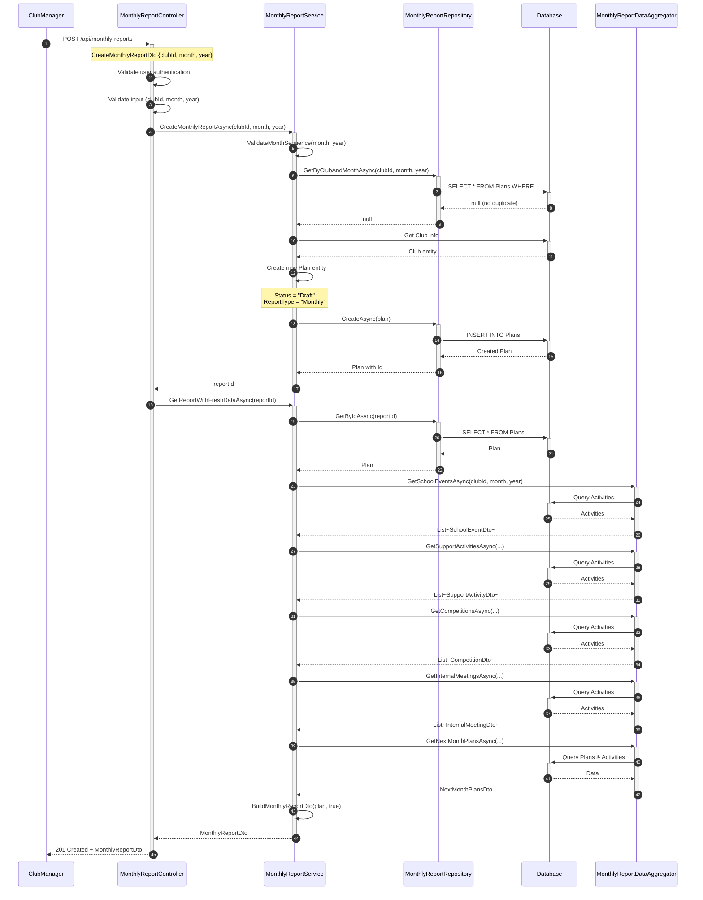
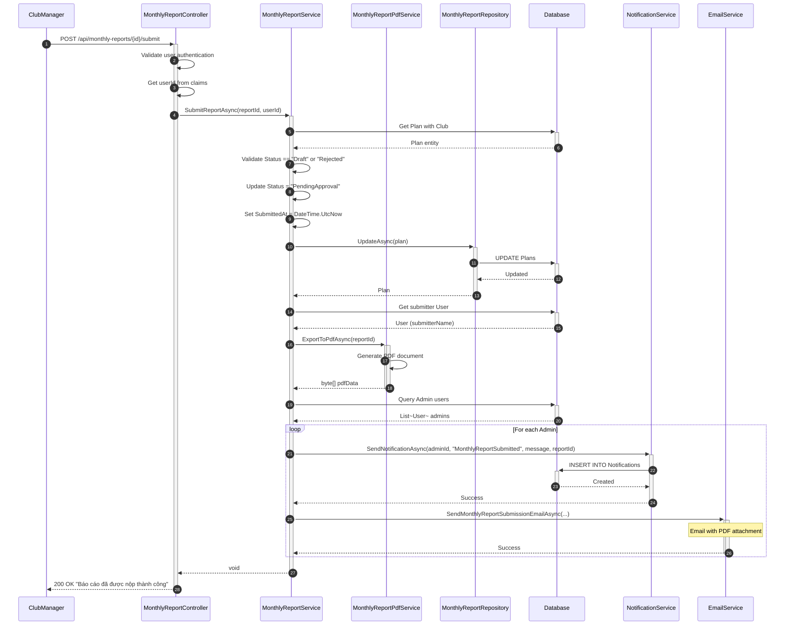
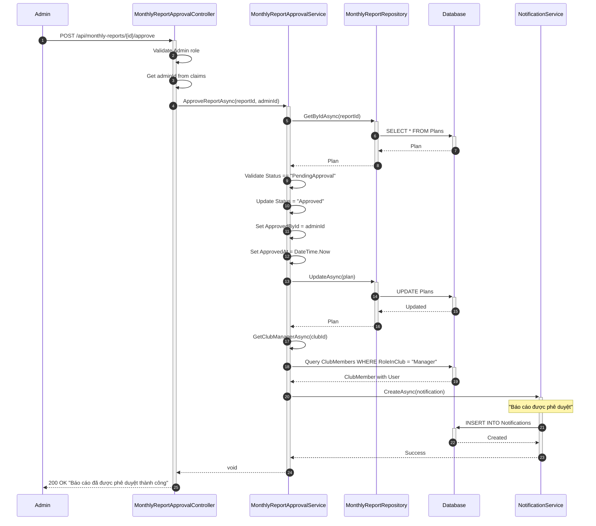
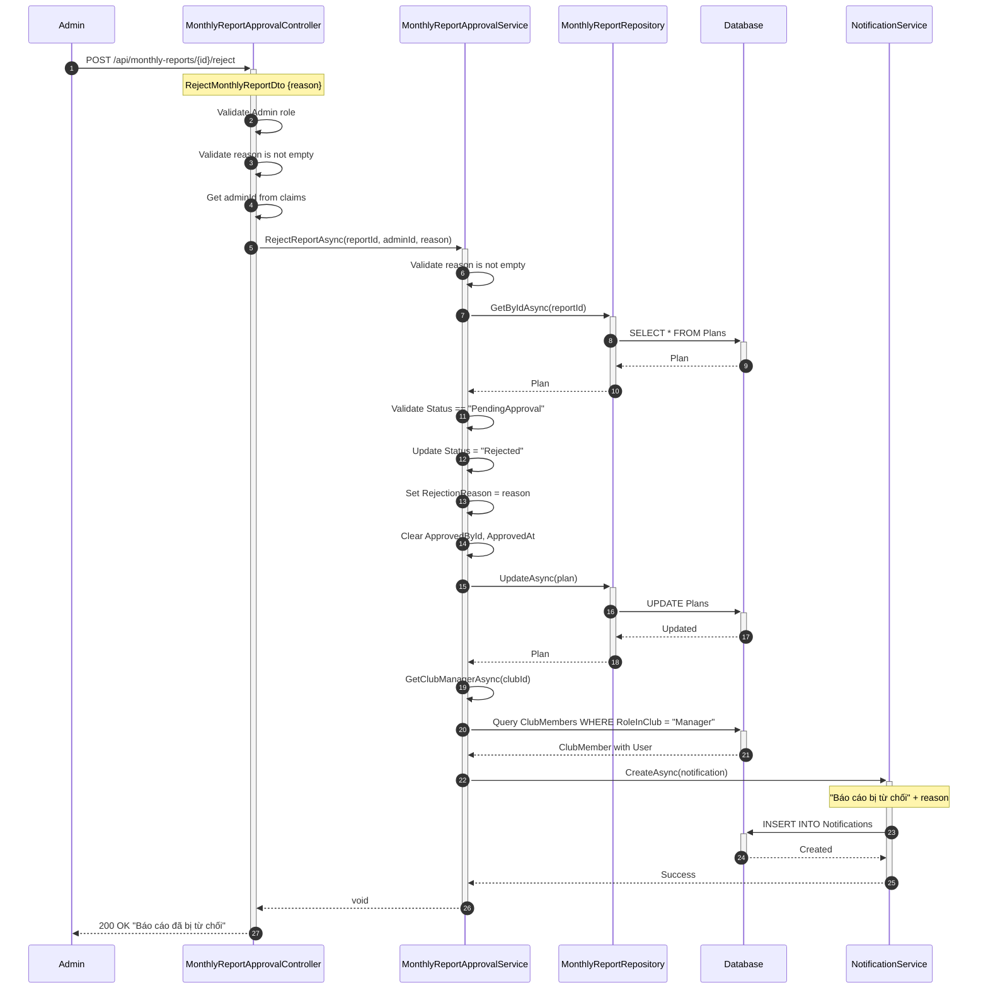
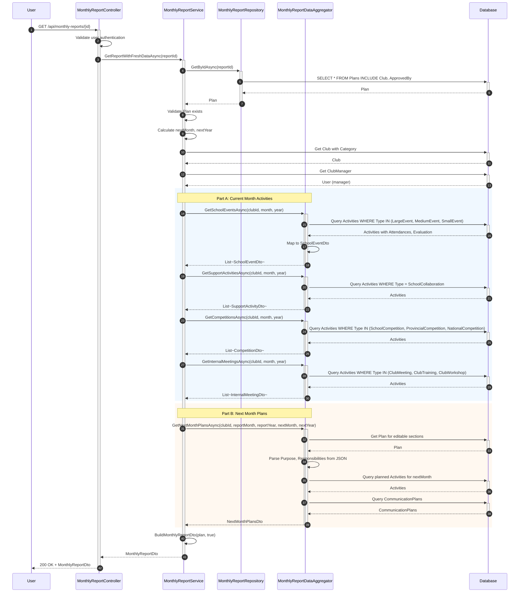
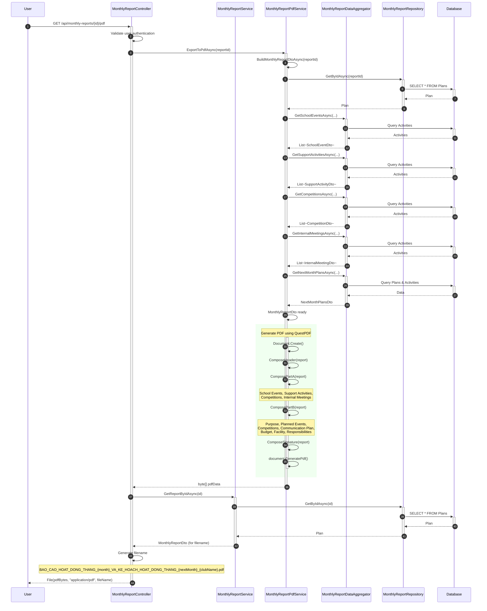
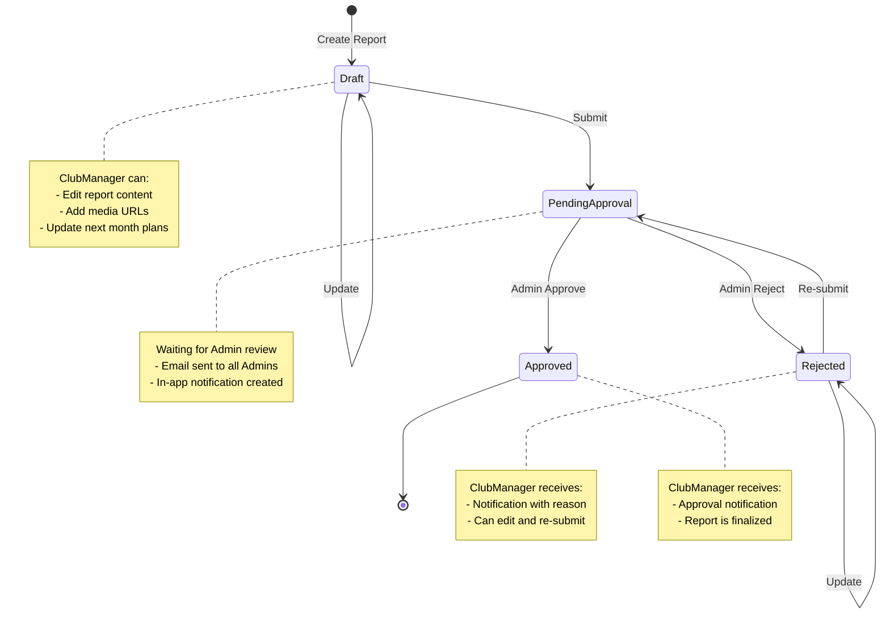
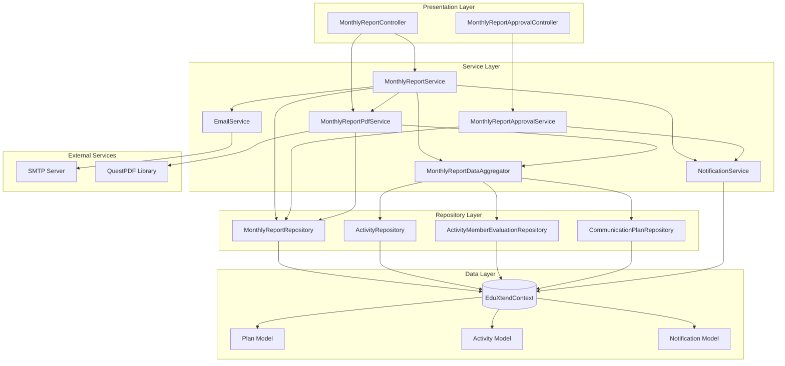
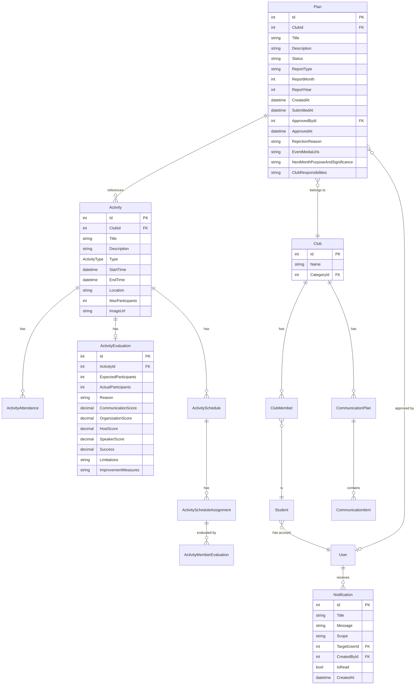

# Monthly Report - Software Design Diagrams

## 1. Class Diagram

```mermaid
classDiagram
    direction TB
    
    %% Controllers
    class MonthlyReportController {
        -IMonthlyReportService _service
        -IMonthlyReportPdfService _pdfService
        -ILogger _logger
        +GetAllReports(clubId) IActionResult
        +GetReport(id) IActionResult
        +CreateReport(dto) IActionResult
        +UpdateReport(id, dto) IActionResult
        +SubmitReport(id) IActionResult
        +ExportToPdf(id) IActionResult
    }
    
    class MonthlyReportApprovalController {
        -IMonthlyReportApprovalService _approvalService
        -ILogger _logger
        +ApproveReport(id) IActionResult
        +RejectReport(id, dto) IActionResult
    }
    
    %% Service Interfaces
    class IMonthlyReportService {
        <<interface>>
        +GetAllReportsAsync(clubId) Task~List~MonthlyReportListDto~~
        +GetAllReportsForAdminAsync() Task~List~MonthlyReportListDto~~
        +GetReportByIdAsync(reportId) Task~MonthlyReportDto~
        +GetReportWithFreshDataAsync(reportId) Task~MonthlyReportDto~
        +CreateMonthlyReportAsync(clubId, month, year) Task~int~
        +UpdateReportAsync(reportId, dto) Task
        +SubmitReportAsync(reportId, userId) Task
    }
    
    class IMonthlyReportApprovalService {
        <<interface>>
        +ApproveReportAsync(reportId, adminId) Task
        +RejectReportAsync(reportId, adminId, reason) Task
    }
    
    class IMonthlyReportDataAggregator {
        <<interface>>
        +GetSchoolEventsAsync(clubId, month, year) Task~List~SchoolEventDto~~
        +GetSupportActivitiesAsync(clubId, month, year) Task~List~SupportActivityDto~~
        +GetCompetitionsAsync(clubId, month, year) Task~List~CompetitionDto~~
        +GetInternalMeetingsAsync(clubId, month, year) Task~List~InternalMeetingDto~~
        +GetNextMonthPlansAsync(clubId, reportMonth, reportYear, nextMonth, nextYear) Task~NextMonthPlansDto~
    }
    
    class IMonthlyReportPdfService {
        <<interface>>
        +ExportToPdfAsync(reportId) Task~byte[]~
    }
    
    %% Service Implementations
    class MonthlyReportService {
        -IMonthlyReportRepository _reportRepo
        -IMonthlyReportDataAggregator _dataAggregator
        -INotificationService _notificationService
        -IEmailService _emailService
        -IMonthlyReportPdfService _pdfService
        -ILogger _logger
        -EduXtendContext _context
        +GetAllReportsAsync(clubId) Task~List~MonthlyReportListDto~~
        +GetAllReportsForAdminAsync() Task~List~MonthlyReportListDto~~
        +GetReportByIdAsync(reportId) Task~MonthlyReportDto~
        +GetReportWithFreshDataAsync(reportId) Task~MonthlyReportDto~
        +CreateMonthlyReportAsync(clubId, month, year) Task~int~
        +UpdateReportAsync(reportId, dto) Task
        +SubmitReportAsync(reportId, userId) Task
        -ValidateMonthSequence(reportMonth, reportYear) string
        -BuildMonthlyReportDto(plan, includeAggregatedData) Task~MonthlyReportDto~
    }
    
    class MonthlyReportApprovalService {
        -IMonthlyReportRepository _reportRepo
        -INotificationService _notificationService
        -EduXtendContext _context
        +ApproveReportAsync(reportId, adminId) Task
        +RejectReportAsync(reportId, adminId, reason) Task
        -GetClubManagerAsync(clubId) Task~User~
    }
    
    class MonthlyReportDataAggregator {
        -IActivityRepository _activityRepo
        -IActivityMemberEvaluationRepository _memberEvalRepo
        -ICommunicationPlanRepository _communicationPlanRepo
        -EduXtendContext _context
        -ILogger _logger
        +GetSchoolEventsAsync(clubId, month, year) Task~List~SchoolEventDto~~
        +GetSupportActivitiesAsync(clubId, month, year) Task~List~SupportActivityDto~~
        +GetCompetitionsAsync(clubId, month, year) Task~List~CompetitionDto~~
        +GetInternalMeetingsAsync(clubId, month, year) Task~List~InternalMeetingDto~~
        +GetNextMonthPlansAsync(clubId, reportMonth, reportYear, nextMonth, nextYear) Task~NextMonthPlansDto~
        -GetStudentCode(userId) string
        -GetSupportMembersAsync(activityId, clubId) Task~List~SupportMemberDto~~
        -GetActivityTimelineAsync(activityId) Task~string~
    }
    
    class MonthlyReportPdfService {
        -IMonthlyReportRepository _reportRepo
        -IMonthlyReportDataAggregator _dataAggregator
        -EduXtendContext _context
        +ExportToPdfAsync(reportId) Task~byte[]~
        -BuildMonthlyReportDtoAsync(reportId) Task~MonthlyReportDto~
        -ComposeDocument(container, report) void
        -ComposeHeader(column, report) void
        -ComposePartA(column, report) void
        -ComposePartB(column, report) void
        -ComposeSignature(column, report) void
    }
    
    %% Repository
    class IMonthlyReportRepository {
        <<interface>>
        +GetAllByClubIdAsync(clubId) Task~List~Plan~~
        +GetByIdAsync(id) Task~Plan~
        +CreateAsync(plan) Task~Plan~
        +UpdateAsync(plan) Task~Plan~
        +GetByClubAndMonthAsync(clubId, month, year) Task~Plan~
    }
    
    class MonthlyReportRepository {
        -EduXtendContext _ctx
        +GetAllByClubIdAsync(clubId) Task~List~Plan~~
        +GetByIdAsync(id) Task~Plan~
        +CreateAsync(plan) Task~Plan~
        +UpdateAsync(plan) Task~Plan~
        +GetByClubAndMonthAsync(clubId, month, year) Task~Plan~
    }
    
    %% Models
    class Plan {
        +int Id
        +int ClubId
        +Club Club
        +string Title
        +string Description
        +string Status
        +DateTime CreatedAt
        +DateTime SubmittedAt
        +int ApprovedById
        +User ApprovedBy
        +DateTime ApprovedAt
        +string ReportType
        +int ReportMonth
        +int ReportYear
        +string ReportActivityIds
        +string ReportSnapshot
        +string RejectionReason
        +string EventMediaUrls
        +string NextMonthPurposeAndSignificance
        +string ClubResponsibilities
    }
    
    %% DTOs
    class MonthlyReportDto {
        +int Id
        +int ClubId
        +string ClubName
        +string DepartmentName
        +string Status
        +int ReportMonth
        +int ReportYear
        +int NextMonth
        +int NextYear
        +HeaderDto Header
        +CurrentMonthActivitiesDto CurrentMonthActivities
        +NextMonthPlansDto NextMonthPlans
        +FooterDto Footer
        +DateTime CreatedAt
        +DateTime SubmittedAt
        +DateTime ApprovedAt
        +string RejectionReason
    }
    
    class MonthlyReportListDto {
        +int Id
        +int ClubId
        +string ClubName
        +string Status
        +int ReportMonth
        +int ReportYear
        +DateTime CreatedAt
        +DateTime SubmittedAt
    }
    
    class CurrentMonthActivitiesDto {
        +List~SchoolEventDto~ SchoolEvents
        +List~SupportActivityDto~ SupportActivities
        +List~CompetitionDto~ Competitions
        +List~InternalMeetingDto~ InternalMeetings
    }
    
    class NextMonthPlansDto {
        +PurposeDto Purpose
        +List~PlannedEventDto~ PlannedEvents
        +List~PlannedCompetitionDto~ PlannedCompetitions
        +List~CommunicationItemDto~ CommunicationPlan
        +BudgetDto Budget
        +FacilityDto Facility
        +ClubResponsibilitiesDto Responsibilities
    }
    
    %% External Services
    class INotificationService {
        <<interface>>
        +SendNotificationAsync(userId, type, message, referenceId) Task
        +CreateAsync(notification) Task
    }
    
    class IEmailService {
        <<interface>>
        +SendMonthlyReportSubmissionEmailAsync(...) Task
    }
    
    %% Relationships
    MonthlyReportController --> IMonthlyReportService
    MonthlyReportController --> IMonthlyReportPdfService
    MonthlyReportApprovalController --> IMonthlyReportApprovalService
    
    IMonthlyReportService <|.. MonthlyReportService
    IMonthlyReportApprovalService <|.. MonthlyReportApprovalService
    IMonthlyReportDataAggregator <|.. MonthlyReportDataAggregator
    IMonthlyReportPdfService <|.. MonthlyReportPdfService
    IMonthlyReportRepository <|.. MonthlyReportRepository
    
    MonthlyReportService --> IMonthlyReportRepository
    MonthlyReportService --> IMonthlyReportDataAggregator
    MonthlyReportService --> INotificationService
    MonthlyReportService --> IEmailService
    MonthlyReportService --> IMonthlyReportPdfService
    
    MonthlyReportApprovalService --> IMonthlyReportRepository
    MonthlyReportApprovalService --> INotificationService
    
    MonthlyReportPdfService --> IMonthlyReportRepository
    MonthlyReportPdfService --> IMonthlyReportDataAggregator
    
    MonthlyReportRepository --> Plan
    MonthlyReportService ..> MonthlyReportDto : creates
    MonthlyReportService ..> MonthlyReportListDto : creates
    MonthlyReportDataAggregator ..> CurrentMonthActivitiesDto : creates
    MonthlyReportDataAggregator ..> NextMonthPlansDto : creates
    
    MonthlyReportDto *-- CurrentMonthActivitiesDto
    MonthlyReportDto *-- NextMonthPlansDto
```

---

## 2. Sequence Diagrams

### 2.1. Create Monthly Report

### 2.2. Submit Monthly Report for Approval

### 2.3. Approve Monthly Report (Admin)

### 2.4. Reject Monthly Report (Admin)

### 2.5. Get Monthly Report with Fresh Data

### 2.6. Export Monthly Report to PDF

---

## 3. State Diagram - Monthly Report Status

---

## 4. Component Diagram

---

## 5. ER Diagram - Monthly Report Related Entities

---

## Ghi chú

### Các trạng thái của Monthly Report:
1. **Draft**: Báo cáo mới tạo, ClubManager có thể chỉnh sửa
2. **PendingApproval**: Đã nộp, đang chờ Admin phê duyệt
3. **Approved**: Đã được Admin phê duyệt
4. **Rejected**: Bị Admin từ chối, ClubManager có thể chỉnh sửa và nộp lại

### Các thành phần chính:
- **MonthlyReportService**: Xử lý logic nghiệp vụ chính (CRUD, submit)
- **MonthlyReportApprovalService**: Xử lý phê duyệt/từ chối (Admin only)
- **MonthlyReportDataAggregator**: Tổng hợp dữ liệu từ nhiều nguồn (Activities, Evaluations, etc.)
- **MonthlyReportPdfService**: Xuất báo cáo ra file PDF
- **MonthlyReportRepository**: Truy cập dữ liệu Plan (Monthly Report)
