# 3.6 Monthly Report Management - Software Design Diagrams

## Tổng quan các chức năng con

| STT | Chức năng | Mô tả | Actor |
|-----|-----------|-------|-------|
| 3.6.1 | Create Monthly Report | Tạo báo cáo tháng mới | ClubManager |
| 3.6.2 | View Monthly Report List | Xem danh sách báo cáo | ClubManager, Admin |
| 3.6.3 | View Monthly Report Detail | Xem chi tiết báo cáo | ClubManager, Admin |
| 3.6.4 | Update Monthly Report | Cập nhật nội dung báo cáo | ClubManager |
| 3.6.5 | Submit Monthly Report | Nộp báo cáo để phê duyệt | ClubManager |
| 3.6.6 | Approve Monthly Report | Phê duyệt báo cáo | Admin |
| 3.6.7 | Reject Monthly Report | Từ chối báo cáo | Admin |
| 3.6.8 | Export Monthly Report to PDF | Xuất báo cáo ra PDF | ClubManager, Admin |

---

## 1. Class Diagram - Tổng quan

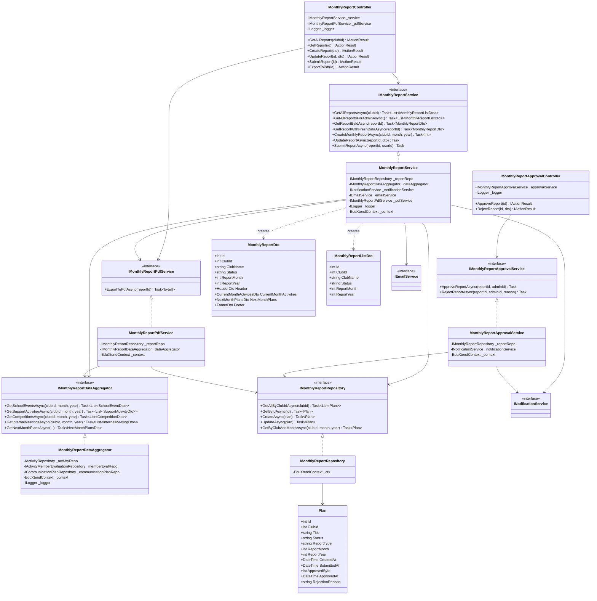
```mermaid
classDiagram
    direction TB
    
    %% Controllers
    class MonthlyReportController {
        -IMonthlyReportService _service
        -IMonthlyReportPdfService _pdfService
        -ILogger _logger
        +GetAllReports(clubId) IActionResult
        +GetReport(id) IActionResult
        +CreateReport(dto) IActionResult
        +UpdateReport(id, dto) IActionResult
        +SubmitReport(id) IActionResult
        +ExportToPdf(id) IActionResult
    }
    
    class MonthlyReportApprovalController {
        -IMonthlyReportApprovalService _approvalService
        -ILogger _logger
        +ApproveReport(id) IActionResult
        +RejectReport(id, dto) IActionResult
    }
    
    %% Service Interfaces
    class IMonthlyReportService {
        <<interface>>
        +GetAllReportsAsync(clubId) Task~List~MonthlyReportListDto~~
        +GetAllReportsForAdminAsync() Task~List~MonthlyReportListDto~~
        +GetReportByIdAsync(reportId) Task~MonthlyReportDto~
        +GetReportWithFreshDataAsync(reportId) Task~MonthlyReportDto~
        +CreateMonthlyReportAsync(clubId, month, year) Task~int~
        +UpdateReportAsync(reportId, dto) Task
        +SubmitReportAsync(reportId, userId) Task
    }
    
    class IMonthlyReportApprovalService {
        <<interface>>
        +ApproveReportAsync(reportId, adminId) Task
        +RejectReportAsync(reportId, adminId, reason) Task
    }
    
    class IMonthlyReportDataAggregator {
        <<interface>>
        +GetSchoolEventsAsync(clubId, month, year) Task~List~SchoolEventDto~~
        +GetSupportActivitiesAsync(clubId, month, year) Task~List~SupportActivityDto~~
        +GetCompetitionsAsync(clubId, month, year) Task~List~CompetitionDto~~
        +GetInternalMeetingsAsync(clubId, month, year) Task~List~InternalMeetingDto~~
        +GetNextMonthPlansAsync(...) Task~NextMonthPlansDto~
    }
    
    class IMonthlyReportPdfService {
        <<interface>>
        +ExportToPdfAsync(reportId) Task~byte[]~
    }
    
    %% Service Implementations
    class MonthlyReportService {
        -IMonthlyReportRepository _reportRepo
        -IMonthlyReportDataAggregator _dataAggregator
        -INotificationService _notificationService
        -IEmailService _emailService
        -IMonthlyReportPdfService _pdfService
        -ILogger _logger
        -EduXtendContext _context
    }
    
    class MonthlyReportApprovalService {
        -IMonthlyReportRepository _reportRepo
        -INotificationService _notificationService
        -EduXtendContext _context
    }
    
    class MonthlyReportDataAggregator {
        -IActivityRepository _activityRepo
        -IActivityMemberEvaluationRepository _memberEvalRepo
        -ICommunicationPlanRepository _communicationPlanRepo
        -EduXtendContext _context
        -ILogger _logger
    }
    
    class MonthlyReportPdfService {
        -IMonthlyReportRepository _reportRepo
        -IMonthlyReportDataAggregator _dataAggregator
        -EduXtendContext _context
    }
    
    %% Repository
    class IMonthlyReportRepository {
        <<interface>>
        +GetAllByClubIdAsync(clubId) Task~List~Plan~~
        +GetByIdAsync(id) Task~Plan~
        +CreateAsync(plan) Task~Plan~
        +UpdateAsync(plan) Task~Plan~
        +GetByClubAndMonthAsync(clubId, month, year) Task~Plan~
    }
    
    class MonthlyReportRepository {
        -EduXtendContext _ctx
    }
    
    %% Models
    class Plan {
        +int Id
        +int ClubId
        +string Title
        +string Status
        +string ReportType
        +int ReportMonth
        +int ReportYear
        +DateTime CreatedAt
        +DateTime SubmittedAt
        +int ApprovedById
        +DateTime ApprovedAt
        +string RejectionReason
    }
    
    %% DTOs
    class MonthlyReportDto {
        +int Id
        +int ClubId
        +string ClubName
        +string Status
        +int ReportMonth
        +int ReportYear
        +HeaderDto Header
        +CurrentMonthActivitiesDto CurrentMonthActivities
        +NextMonthPlansDto NextMonthPlans
        +FooterDto Footer
    }
    
    class MonthlyReportListDto {
        +int Id
        +int ClubId
        +string ClubName
        +string Status
        +int ReportMonth
        +int ReportYear
    }
    
    %% External Services
    class INotificationService {
        <<interface>>
    }
    
    class IEmailService {
        <<interface>>
    }
    
    %% Relationships
    MonthlyReportController --> IMonthlyReportService
    MonthlyReportController --> IMonthlyReportPdfService
    MonthlyReportApprovalController --> IMonthlyReportApprovalService
    
    IMonthlyReportService <|.. MonthlyReportService
    IMonthlyReportApprovalService <|.. MonthlyReportApprovalService
    IMonthlyReportDataAggregator <|.. MonthlyReportDataAggregator
    IMonthlyReportPdfService <|.. MonthlyReportPdfService
    IMonthlyReportRepository <|.. MonthlyReportRepository
    
    MonthlyReportService --> IMonthlyReportRepository
    MonthlyReportService --> IMonthlyReportDataAggregator
    MonthlyReportService --> INotificationService
    MonthlyReportService --> IEmailService
    MonthlyReportService --> IMonthlyReportPdfService
    
    MonthlyReportApprovalService --> IMonthlyReportRepository
    MonthlyReportApprovalService --> INotificationService
    
    MonthlyReportPdfService --> IMonthlyReportRepository
    MonthlyReportPdfService --> IMonthlyReportDataAggregator
    
    MonthlyReportRepository --> Plan
    MonthlyReportService ..> MonthlyReportDto : creates
    MonthlyReportService ..> MonthlyReportListDto : creates
```

---

## 2. Sequence Diagrams theo từng chức năng

### 3.6.1 Create Monthly Report (Tạo báo cáo tháng)

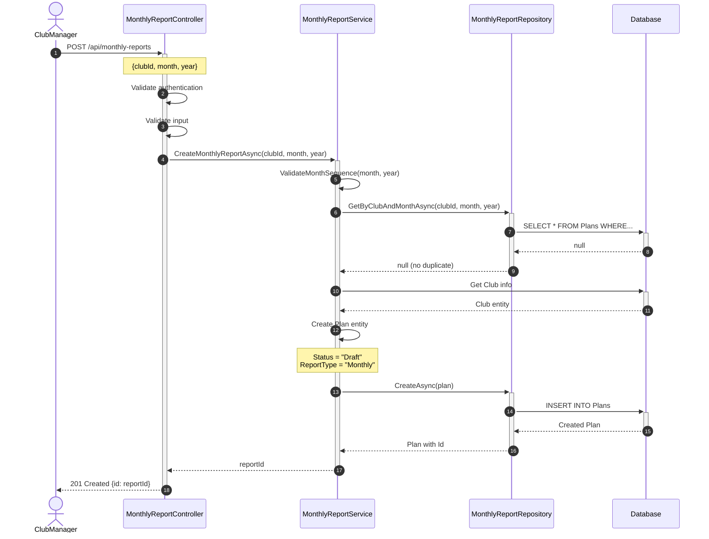
```mermaid
sequenceDiagram
    autonumber
    actor CM as ClubManager
    participant API as MonthlyReportController
    participant SVC as MonthlyReportService
    participant REPO as MonthlyReportRepository
    participant DB as Database
    
    CM->>+API: POST /api/monthly-reports
    Note over API: {clubId, month, year}
    
    API->>API: Validate authentication
    API->>API: Validate input
    
    API->>+SVC: CreateMonthlyReportAsync(clubId, month, year)
    
    SVC->>SVC: ValidateMonthSequence(month, year)
    
    SVC->>+REPO: GetByClubAndMonthAsync(clubId, month, year)
    REPO->>+DB: SELECT * FROM Plans WHERE...
    DB-->>-REPO: null
    REPO-->>-SVC: null (no duplicate)
    
    SVC->>+DB: Get Club info
    DB-->>-SVC: Club entity
    
    SVC->>SVC: Create Plan entity
    Note over SVC: Status = "Draft"<br/>ReportType = "Monthly"
    
    SVC->>+REPO: CreateAsync(plan)
    REPO->>+DB: INSERT INTO Plans
    DB-->>-REPO: Created Plan
    REPO-->>-SVC: Plan with Id
    
    SVC-->>-API: reportId
    
    API-->>-CM: 201 Created {id: reportId}
```

---

### 3.6.2 View Monthly Report List (Xem danh sách báo cáo)

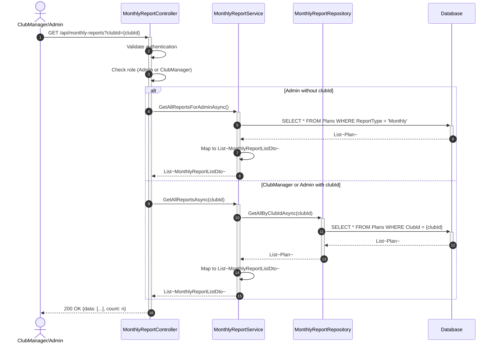
```mermaid
sequenceDiagram
    autonumber
    actor User as ClubManager/Admin
    participant API as MonthlyReportController
    participant SVC as MonthlyReportService
    participant REPO as MonthlyReportRepository
    participant DB as Database
    
    User->>+API: GET /api/monthly-reports?clubId={clubId}
    
    API->>API: Validate authentication
    API->>API: Check role (Admin or ClubManager)
    
    alt Admin without clubId
        API->>+SVC: GetAllReportsForAdminAsync()
        SVC->>+DB: SELECT * FROM Plans WHERE ReportType = 'Monthly'
        DB-->>-SVC: List~Plan~
        SVC->>SVC: Map to List~MonthlyReportListDto~
        SVC-->>-API: List~MonthlyReportListDto~
    else ClubManager or Admin with clubId
        API->>+SVC: GetAllReportsAsync(clubId)
        SVC->>+REPO: GetAllByClubIdAsync(clubId)
        REPO->>+DB: SELECT * FROM Plans WHERE ClubId = {clubId}
        DB-->>-REPO: List~Plan~
        REPO-->>-SVC: List~Plan~
        SVC->>SVC: Map to List~MonthlyReportListDto~
        SVC-->>-API: List~MonthlyReportListDto~
    end
    
    API-->>-User: 200 OK {data: [...], count: n}
```

---

### 3.6.3 View Monthly Report Detail (Xem chi tiết báo cáo)

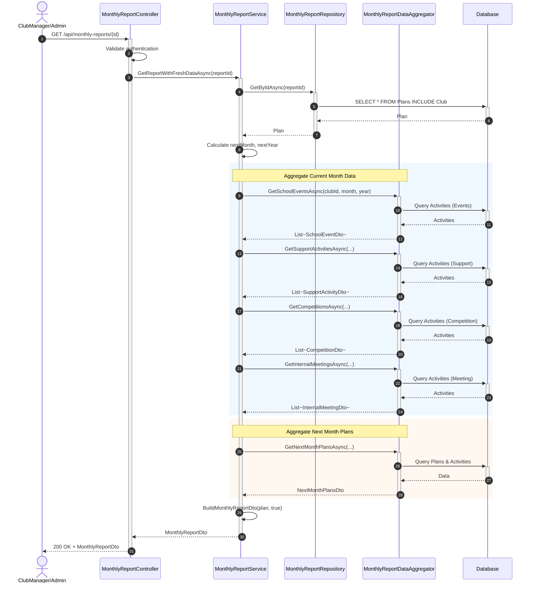
```mermaid
sequenceDiagram
    autonumber
    actor User as ClubManager/Admin
    participant API as MonthlyReportController
    participant SVC as MonthlyReportService
    participant REPO as MonthlyReportRepository
    participant AGG as MonthlyReportDataAggregator
    participant DB as Database
    
    User->>+API: GET /api/monthly-reports/{id}
    
    API->>API: Validate authentication
    
    API->>+SVC: GetReportWithFreshDataAsync(reportId)
    
    SVC->>+REPO: GetByIdAsync(reportId)
    REPO->>+DB: SELECT * FROM Plans INCLUDE Club
    DB-->>-REPO: Plan
    REPO-->>-SVC: Plan
    
    SVC->>SVC: Calculate nextMonth, nextYear
    
    rect rgb(240, 248, 255)
        Note over SVC,AGG: Aggregate Current Month Data
        SVC->>+AGG: GetSchoolEventsAsync(clubId, month, year)
        AGG->>+DB: Query Activities (Events)
        DB-->>-AGG: Activities
        AGG-->>-SVC: List~SchoolEventDto~
        
        SVC->>+AGG: GetSupportActivitiesAsync(...)
        AGG->>+DB: Query Activities (Support)
        DB-->>-AGG: Activities
        AGG-->>-SVC: List~SupportActivityDto~
        
        SVC->>+AGG: GetCompetitionsAsync(...)
        AGG->>+DB: Query Activities (Competition)
        DB-->>-AGG: Activities
        AGG-->>-SVC: List~CompetitionDto~
        
        SVC->>+AGG: GetInternalMeetingsAsync(...)
        AGG->>+DB: Query Activities (Meeting)
        DB-->>-AGG: Activities
        AGG-->>-SVC: List~InternalMeetingDto~
    end
    
    rect rgb(255, 248, 240)
        Note over SVC,AGG: Aggregate Next Month Plans
        SVC->>+AGG: GetNextMonthPlansAsync(...)
        AGG->>+DB: Query Plans & Activities
        DB-->>-AGG: Data
        AGG-->>-SVC: NextMonthPlansDto
    end
    
    SVC->>SVC: BuildMonthlyReportDto(plan, true)
    SVC-->>-API: MonthlyReportDto
    
    API-->>-User: 200 OK + MonthlyReportDto
```

---

### 3.6.4 Update Monthly Report (Cập nhật báo cáo)

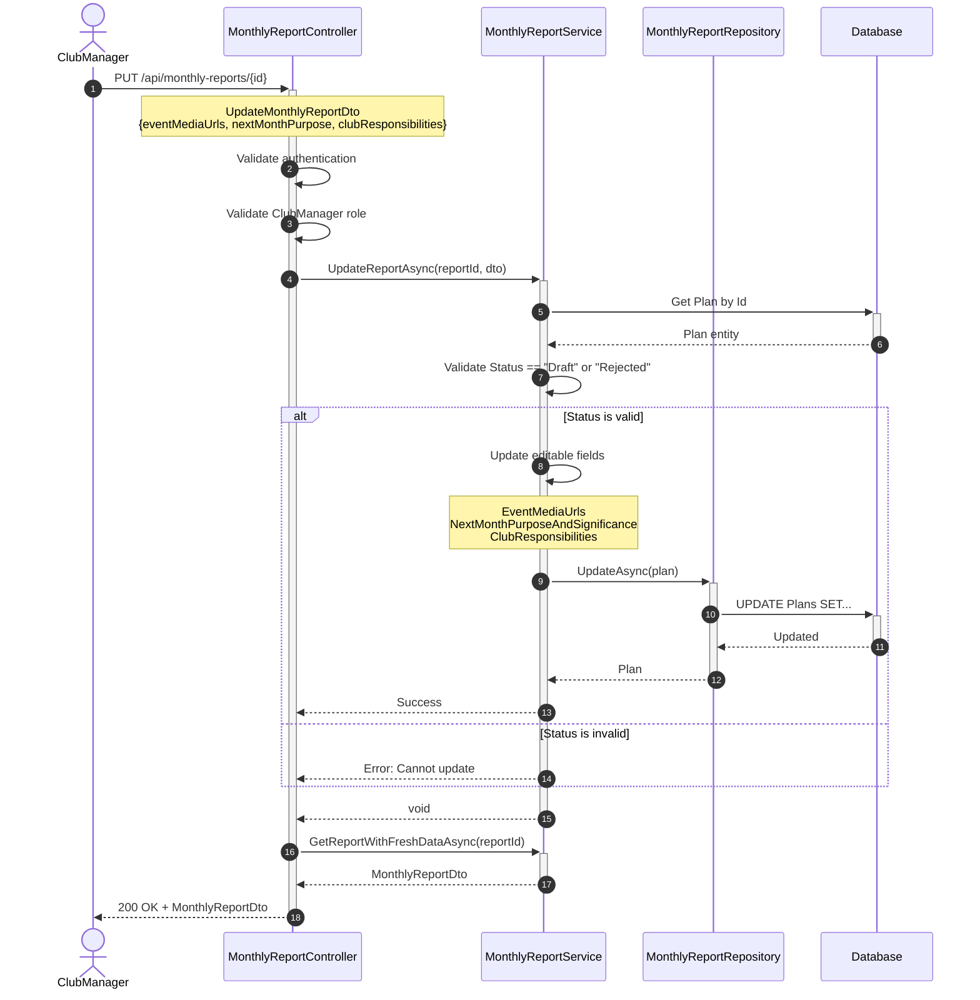
```mermaid
sequenceDiagram
    autonumber
    actor CM as ClubManager
    participant API as MonthlyReportController
    participant SVC as MonthlyReportService
    participant REPO as MonthlyReportRepository
    participant DB as Database
    
    CM->>+API: PUT /api/monthly-reports/{id}
    Note over API: UpdateMonthlyReportDto<br/>{eventMediaUrls, nextMonthPurpose, clubResponsibilities}
    
    API->>API: Validate authentication
    API->>API: Validate ClubManager role
    
    API->>+SVC: UpdateReportAsync(reportId, dto)
    
    SVC->>+DB: Get Plan by Id
    DB-->>-SVC: Plan entity
    
    SVC->>SVC: Validate Status == "Draft" or "Rejected"
    
    alt Status is valid
        SVC->>SVC: Update editable fields
        Note over SVC: EventMediaUrls<br/>NextMonthPurposeAndSignificance<br/>ClubResponsibilities
        
        SVC->>+REPO: UpdateAsync(plan)
        REPO->>+DB: UPDATE Plans SET...
        DB-->>-REPO: Updated
        REPO-->>-SVC: Plan
        
        SVC-->>API: Success
    else Status is invalid
        SVC-->>API: Error: Cannot update
    end
    
    SVC-->>-API: void
    
    API->>+SVC: GetReportWithFreshDataAsync(reportId)
    SVC-->>-API: MonthlyReportDto
    
    API-->>-CM: 200 OK + MonthlyReportDto
```

---

### 3.6.5 Submit Monthly Report (Nộp báo cáo)

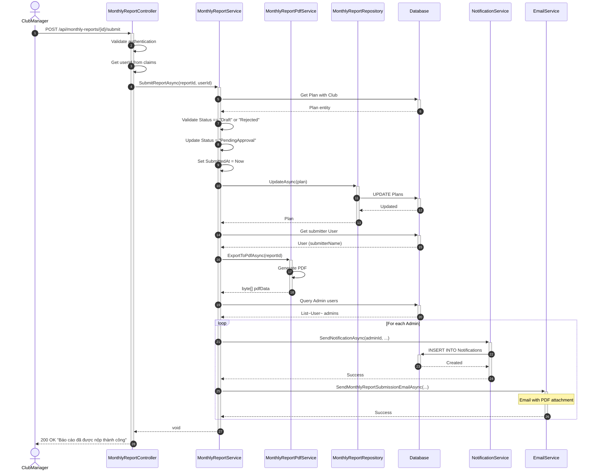
```mermaid
sequenceDiagram
    autonumber
    actor CM as ClubManager
    participant API as MonthlyReportController
    participant SVC as MonthlyReportService
    participant PDF as MonthlyReportPdfService
    participant REPO as MonthlyReportRepository
    participant DB as Database
    participant NOTIF as NotificationService
    participant EMAIL as EmailService
    
    CM->>+API: POST /api/monthly-reports/{id}/submit
    
    API->>API: Validate authentication
    API->>API: Get userId from claims
    
    API->>+SVC: SubmitReportAsync(reportId, userId)
    
    SVC->>+DB: Get Plan with Club
    DB-->>-SVC: Plan entity
    
    SVC->>SVC: Validate Status == "Draft" or "Rejected"
    
    SVC->>SVC: Update Status = "PendingApproval"
    SVC->>SVC: Set SubmittedAt = Now
    
    SVC->>+REPO: UpdateAsync(plan)
    REPO->>+DB: UPDATE Plans
    DB-->>-REPO: Updated
    REPO-->>-SVC: Plan
    
    SVC->>+DB: Get submitter User
    DB-->>-SVC: User (submitterName)
    
    SVC->>+PDF: ExportToPdfAsync(reportId)
    PDF->>PDF: Generate PDF
    PDF-->>-SVC: byte[] pdfData
    
    SVC->>+DB: Query Admin users
    DB-->>-SVC: List~User~ admins
    
    loop For each Admin
        SVC->>+NOTIF: SendNotificationAsync(adminId, ...)
        NOTIF->>+DB: INSERT INTO Notifications
        DB-->>-NOTIF: Created
        NOTIF-->>-SVC: Success
        
        SVC->>+EMAIL: SendMonthlyReportSubmissionEmailAsync(...)
        Note over EMAIL: Email with PDF attachment
        EMAIL-->>-SVC: Success
    end
    
    SVC-->>-API: void
    
    API-->>-CM: 200 OK "Báo cáo đã được nộp thành công"
```

---

### 3.6.6 Approve Monthly Report (Phê duyệt báo cáo)

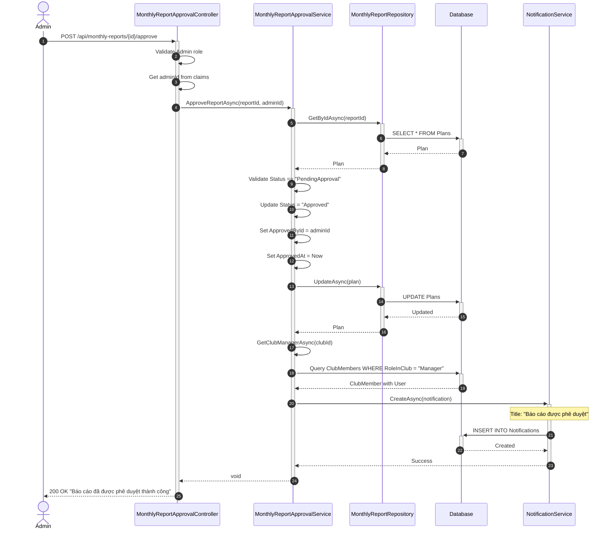
```mermaid
sequenceDiagram
    autonumber
    actor Admin as Admin
    participant API as MonthlyReportApprovalController
    participant SVC as MonthlyReportApprovalService
    participant REPO as MonthlyReportRepository
    participant DB as Database
    participant NOTIF as NotificationService
    
    Admin->>+API: POST /api/monthly-reports/{id}/approve
    
    API->>API: Validate Admin role
    API->>API: Get adminId from claims
    
    API->>+SVC: ApproveReportAsync(reportId, adminId)
    
    SVC->>+REPO: GetByIdAsync(reportId)
    REPO->>+DB: SELECT * FROM Plans
    DB-->>-REPO: Plan
    REPO-->>-SVC: Plan
    
    SVC->>SVC: Validate Status == "PendingApproval"
    
    SVC->>SVC: Update Status = "Approved"
    SVC->>SVC: Set ApprovedById = adminId
    SVC->>SVC: Set ApprovedAt = Now
    
    SVC->>+REPO: UpdateAsync(plan)
    REPO->>+DB: UPDATE Plans
    DB-->>-REPO: Updated
    REPO-->>-SVC: Plan
    
    SVC->>SVC: GetClubManagerAsync(clubId)
    SVC->>+DB: Query ClubMembers WHERE RoleInClub = "Manager"
    DB-->>-SVC: ClubMember with User
    
    SVC->>+NOTIF: CreateAsync(notification)
    Note over NOTIF: Title: "Báo cáo được phê duyệt"
    NOTIF->>+DB: INSERT INTO Notifications
    DB-->>-NOTIF: Created
    NOTIF-->>-SVC: Success
    
    SVC-->>-API: void
    
    API-->>-Admin: 200 OK "Báo cáo đã được phê duyệt thành công"
```

---

### 3.6.7 Reject Monthly Report (Từ chối báo cáo)

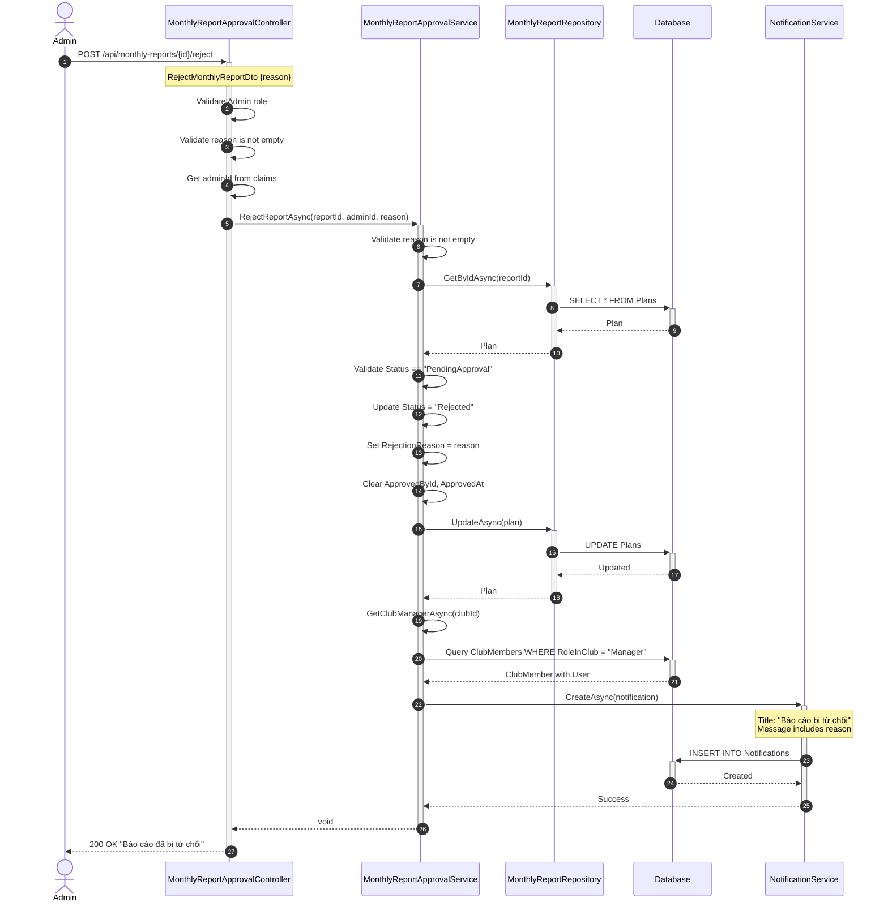
```mermaid
sequenceDiagram
    autonumber
    actor Admin as Admin
    participant API as MonthlyReportApprovalController
    participant SVC as MonthlyReportApprovalService
    participant REPO as MonthlyReportRepository
    participant DB as Database
    participant NOTIF as NotificationService
    
    Admin->>+API: POST /api/monthly-reports/{id}/reject
    Note over API: RejectMonthlyReportDto {reason}
    
    API->>API: Validate Admin role
    API->>API: Validate reason is not empty
    API->>API: Get adminId from claims
    
    API->>+SVC: RejectReportAsync(reportId, adminId, reason)
    
    SVC->>SVC: Validate reason is not empty
    
    SVC->>+REPO: GetByIdAsync(reportId)
    REPO->>+DB: SELECT * FROM Plans
    DB-->>-REPO: Plan
    REPO-->>-SVC: Plan
    
    SVC->>SVC: Validate Status == "PendingApproval"
    
    SVC->>SVC: Update Status = "Rejected"
    SVC->>SVC: Set RejectionReason = reason
    SVC->>SVC: Clear ApprovedById, ApprovedAt
    
    SVC->>+REPO: UpdateAsync(plan)
    REPO->>+DB: UPDATE Plans
    DB-->>-REPO: Updated
    REPO-->>-SVC: Plan
    
    SVC->>SVC: GetClubManagerAsync(clubId)
    SVC->>+DB: Query ClubMembers WHERE RoleInClub = "Manager"
    DB-->>-SVC: ClubMember with User
    
    SVC->>+NOTIF: CreateAsync(notification)
    Note over NOTIF: Title: "Báo cáo bị từ chối"<br/>Message includes reason
    NOTIF->>+DB: INSERT INTO Notifications
    DB-->>-NOTIF: Created
    NOTIF-->>-SVC: Success
    
    SVC-->>-API: void
    
    API-->>-Admin: 200 OK "Báo cáo đã bị từ chối"
```

---

### 3.6.8 Export Monthly Report to PDF (Xuất PDF)

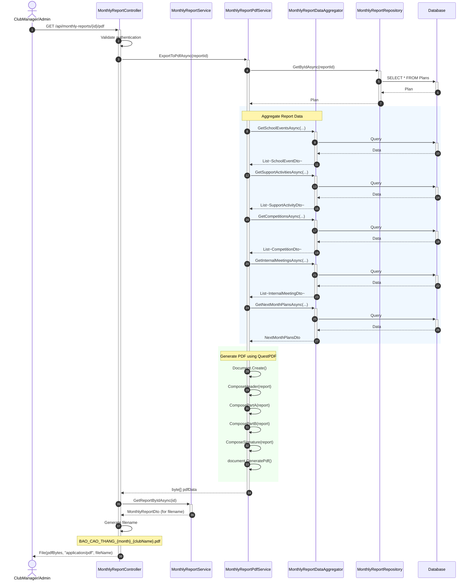
```mermaid
sequenceDiagram
    autonumber
    actor User as ClubManager/Admin
    participant API as MonthlyReportController
    participant SVC as MonthlyReportService
    participant PDF as MonthlyReportPdfService
    participant AGG as MonthlyReportDataAggregator
    participant REPO as MonthlyReportRepository
    participant DB as Database
    
    User->>+API: GET /api/monthly-reports/{id}/pdf
    
    API->>API: Validate authentication
    
    API->>+PDF: ExportToPdfAsync(reportId)
    
    PDF->>+REPO: GetByIdAsync(reportId)
    REPO->>+DB: SELECT * FROM Plans
    DB-->>-REPO: Plan
    REPO-->>-PDF: Plan
    
    rect rgb(240, 248, 255)
        Note over PDF,AGG: Aggregate Report Data
        PDF->>+AGG: GetSchoolEventsAsync(...)
        AGG->>+DB: Query
        DB-->>-AGG: Data
        AGG-->>-PDF: List~SchoolEventDto~
        
        PDF->>+AGG: GetSupportActivitiesAsync(...)
        AGG->>+DB: Query
        DB-->>-AGG: Data
        AGG-->>-PDF: List~SupportActivityDto~
        
        PDF->>+AGG: GetCompetitionsAsync(...)
        AGG->>+DB: Query
        DB-->>-AGG: Data
        AGG-->>-PDF: List~CompetitionDto~
        
        PDF->>+AGG: GetInternalMeetingsAsync(...)
        AGG->>+DB: Query
        DB-->>-AGG: Data
        AGG-->>-PDF: List~InternalMeetingDto~
        
        PDF->>+AGG: GetNextMonthPlansAsync(...)
        AGG->>+DB: Query
        DB-->>-AGG: Data
        AGG-->>-PDF: NextMonthPlansDto
    end
    
    rect rgb(240, 255, 240)
        Note over PDF: Generate PDF using QuestPDF
        PDF->>PDF: Document.Create()
        PDF->>PDF: ComposeHeader(report)
        PDF->>PDF: ComposePartA(report)
        PDF->>PDF: ComposePartB(report)
        PDF->>PDF: ComposeSignature(report)
        PDF->>PDF: document.GeneratePdf()
    end
    
    PDF-->>-API: byte[] pdfData
    
    API->>+SVC: GetReportByIdAsync(id)
    SVC-->>-API: MonthlyReportDto (for filename)
    
    API->>API: Generate filename
    Note over API: BAO_CAO_THANG_{month}_{clubName}.pdf
    
    API-->>-User: File(pdfBytes, "application/pdf", fileName)
```

---

## 3. Class Diagram theo từng chức năng

### 3.6.1-3.6.4 CRUD Operations Class Diagram

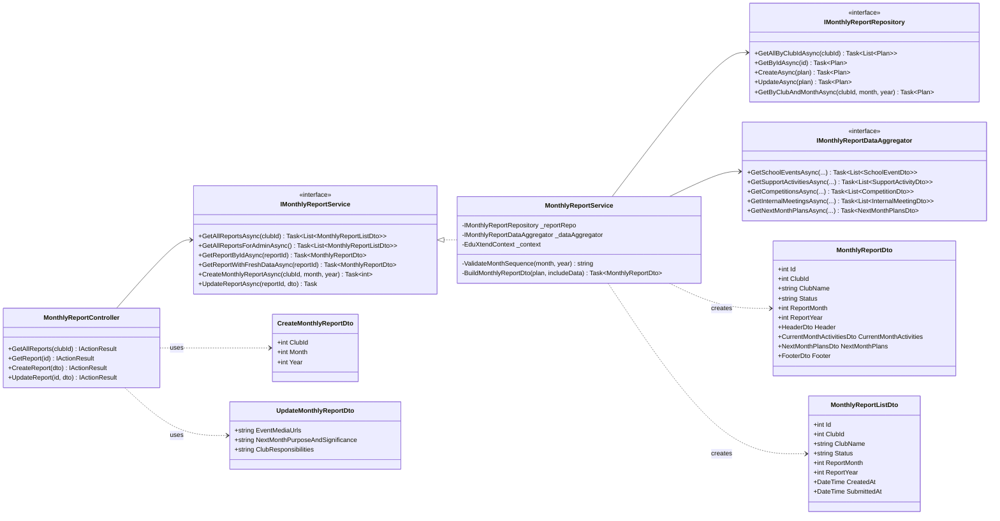
```mermaid
classDiagram
    direction LR
    
    class MonthlyReportController {
        +GetAllReports(clubId) IActionResult
        +GetReport(id) IActionResult
        +CreateReport(dto) IActionResult
        +UpdateReport(id, dto) IActionResult
    }
    
    class IMonthlyReportService {
        <<interface>>
        +GetAllReportsAsync(clubId) Task~List~MonthlyReportListDto~~
        +GetAllReportsForAdminAsync() Task~List~MonthlyReportListDto~~
        +GetReportByIdAsync(reportId) Task~MonthlyReportDto~
        +GetReportWithFreshDataAsync(reportId) Task~MonthlyReportDto~
        +CreateMonthlyReportAsync(clubId, month, year) Task~int~
        +UpdateReportAsync(reportId, dto) Task
    }
    
    class MonthlyReportService {
        -IMonthlyReportRepository _reportRepo
        -IMonthlyReportDataAggregator _dataAggregator
        -EduXtendContext _context
        -ValidateMonthSequence(month, year) string
        -BuildMonthlyReportDto(plan, includeData) Task~MonthlyReportDto~
    }
    
    class IMonthlyReportRepository {
        <<interface>>
        +GetAllByClubIdAsync(clubId) Task~List~Plan~~
        +GetByIdAsync(id) Task~Plan~
        +CreateAsync(plan) Task~Plan~
        +UpdateAsync(plan) Task~Plan~
        +GetByClubAndMonthAsync(clubId, month, year) Task~Plan~
    }
    
    class IMonthlyReportDataAggregator {
        <<interface>>
        +GetSchoolEventsAsync(...) Task~List~SchoolEventDto~~
        +GetSupportActivitiesAsync(...) Task~List~SupportActivityDto~~
        +GetCompetitionsAsync(...) Task~List~CompetitionDto~~
        +GetInternalMeetingsAsync(...) Task~List~InternalMeetingDto~~
        +GetNextMonthPlansAsync(...) Task~NextMonthPlansDto~
    }
    
    class CreateMonthlyReportDto {
        +int ClubId
        +int Month
        +int Year
    }
    
    class UpdateMonthlyReportDto {
        +string EventMediaUrls
        +string NextMonthPurposeAndSignificance
        +string ClubResponsibilities
    }
    
    class MonthlyReportDto {
        +int Id
        +int ClubId
        +string ClubName
        +string Status
        +int ReportMonth
        +int ReportYear
        +HeaderDto Header
        +CurrentMonthActivitiesDto CurrentMonthActivities
        +NextMonthPlansDto NextMonthPlans
        +FooterDto Footer
    }
    
    class MonthlyReportListDto {
        +int Id
        +int ClubId
        +string ClubName
        +string Status
        +int ReportMonth
        +int ReportYear
        +DateTime CreatedAt
        +DateTime SubmittedAt
    }
    
    MonthlyReportController --> IMonthlyReportService
    IMonthlyReportService <|.. MonthlyReportService
    MonthlyReportService --> IMonthlyReportRepository
    MonthlyReportService --> IMonthlyReportDataAggregator
    MonthlyReportController ..> CreateMonthlyReportDto : uses
    MonthlyReportController ..> UpdateMonthlyReportDto : uses
    MonthlyReportService ..> MonthlyReportDto : creates
    MonthlyReportService ..> MonthlyReportListDto : creates
```

---

### 3.6.5 Submit Report Class Diagram

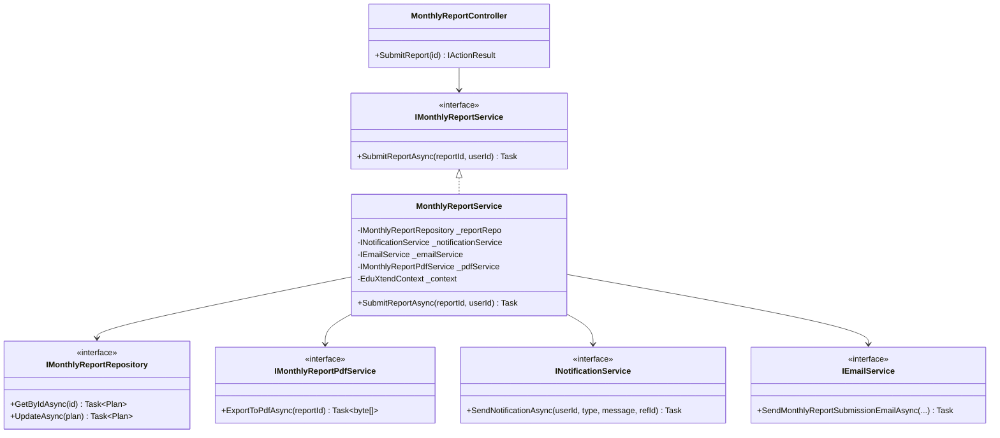
```mermaid
classDiagram
    direction TB
    
    class MonthlyReportController {
        +SubmitReport(id) IActionResult
    }
    
    class IMonthlyReportService {
        <<interface>>
        +SubmitReportAsync(reportId, userId) Task
    }
    
    class MonthlyReportService {
        -IMonthlyReportRepository _reportRepo
        -INotificationService _notificationService
        -IEmailService _emailService
        -IMonthlyReportPdfService _pdfService
        -EduXtendContext _context
        +SubmitReportAsync(reportId, userId) Task
    }
    
    class IMonthlyReportPdfService {
        <<interface>>
        +ExportToPdfAsync(reportId) Task~byte[]~
    }
    
    class INotificationService {
        <<interface>>
        +SendNotificationAsync(userId, type, message, refId) Task
    }
    
    class IEmailService {
        <<interface>>
        +SendMonthlyReportSubmissionEmailAsync(...) Task
    }
    
    class IMonthlyReportRepository {
        <<interface>>
        +GetByIdAsync(id) Task~Plan~
        +UpdateAsync(plan) Task~Plan~
    }
    
    MonthlyReportController --> IMonthlyReportService
    IMonthlyReportService <|.. MonthlyReportService
    MonthlyReportService --> IMonthlyReportRepository
    MonthlyReportService --> IMonthlyReportPdfService
    MonthlyReportService --> INotificationService
    MonthlyReportService --> IEmailService
```

---

### 3.6.6-3.6.7 Approval/Rejection Class Diagram

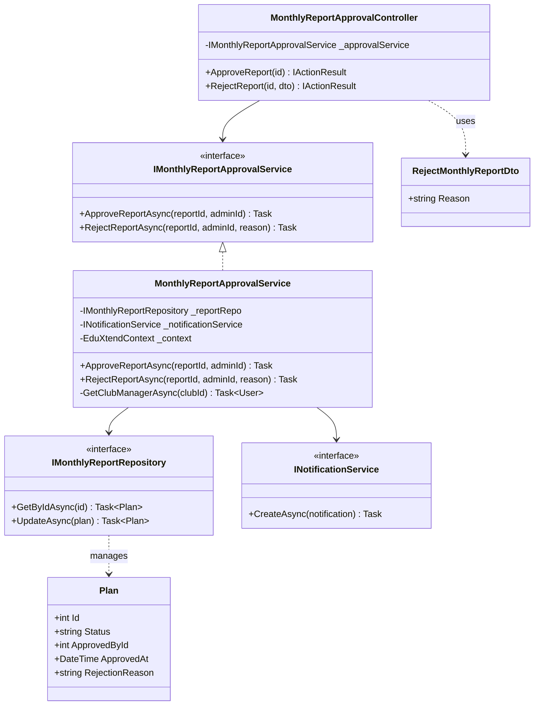
```mermaid
classDiagram
    direction TB
    
    class MonthlyReportApprovalController {
        -IMonthlyReportApprovalService _approvalService
        +ApproveReport(id) IActionResult
        +RejectReport(id, dto) IActionResult
    }
    
    class IMonthlyReportApprovalService {
        <<interface>>
        +ApproveReportAsync(reportId, adminId) Task
        +RejectReportAsync(reportId, adminId, reason) Task
    }
    
    class MonthlyReportApprovalService {
        -IMonthlyReportRepository _reportRepo
        -INotificationService _notificationService
        -EduXtendContext _context
        +ApproveReportAsync(reportId, adminId) Task
        +RejectReportAsync(reportId, adminId, reason) Task
        -GetClubManagerAsync(clubId) Task~User~
    }
    
    class IMonthlyReportRepository {
        <<interface>>
        +GetByIdAsync(id) Task~Plan~
        +UpdateAsync(plan) Task~Plan~
    }
    
    class INotificationService {
        <<interface>>
        +CreateAsync(notification) Task
    }
    
    class RejectMonthlyReportDto {
        +string Reason
    }
    
    class Plan {
        +int Id
        +string Status
        +int ApprovedById
        +DateTime ApprovedAt
        +string RejectionReason
    }
    
    MonthlyReportApprovalController --> IMonthlyReportApprovalService
    MonthlyReportApprovalController ..> RejectMonthlyReportDto : uses
    IMonthlyReportApprovalService <|.. MonthlyReportApprovalService
    MonthlyReportApprovalService --> IMonthlyReportRepository
    MonthlyReportApprovalService --> INotificationService
    IMonthlyReportRepository ..> Plan : manages
```

---

### 3.6.8 Export PDF Class Diagram

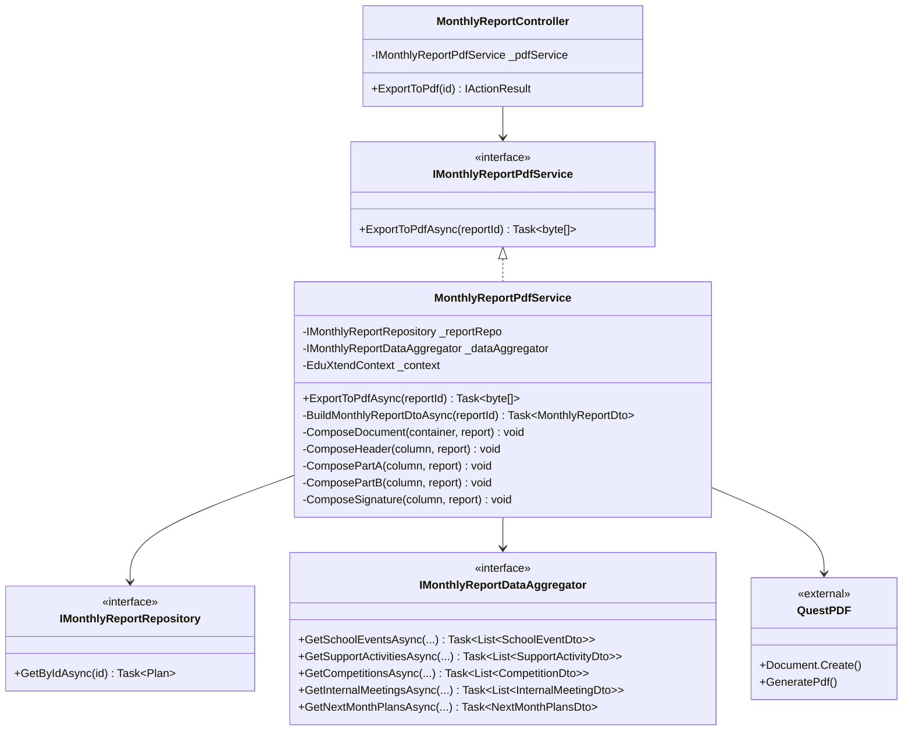
```mermaid
classDiagram
    direction TB
    
    class MonthlyReportController {
        -IMonthlyReportPdfService _pdfService
        +ExportToPdf(id) IActionResult
    }
    
    class IMonthlyReportPdfService {
        <<interface>>
        +ExportToPdfAsync(reportId) Task~byte[]~
    }
    
    class MonthlyReportPdfService {
        -IMonthlyReportRepository _reportRepo
        -IMonthlyReportDataAggregator _dataAggregator
        -EduXtendContext _context
        +ExportToPdfAsync(reportId) Task~byte[]~
        -BuildMonthlyReportDtoAsync(reportId) Task~MonthlyReportDto~
        -ComposeDocument(container, report) void
        -ComposeHeader(column, report) void
        -ComposePartA(column, report) void
        -ComposePartB(column, report) void
        -ComposeSignature(column, report) void
    }
    
    class IMonthlyReportDataAggregator {
        <<interface>>
        +GetSchoolEventsAsync(...) Task~List~SchoolEventDto~~
        +GetSupportActivitiesAsync(...) Task~List~SupportActivityDto~~
        +GetCompetitionsAsync(...) Task~List~CompetitionDto~~
        +GetInternalMeetingsAsync(...) Task~List~InternalMeetingDto~~
        +GetNextMonthPlansAsync(...) Task~NextMonthPlansDto~
    }
    
    class IMonthlyReportRepository {
        <<interface>>
        +GetByIdAsync(id) Task~Plan~
    }
    
    class QuestPDF {
        <<external>>
        +Document.Create()
        +GeneratePdf()
    }
    
    MonthlyReportController --> IMonthlyReportPdfService
    IMonthlyReportPdfService <|.. MonthlyReportPdfService
    MonthlyReportPdfService --> IMonthlyReportRepository
    MonthlyReportPdfService --> IMonthlyReportDataAggregator
    MonthlyReportPdfService --> QuestPDF
```

---

## 4. State Diagram - Monthly Report Status

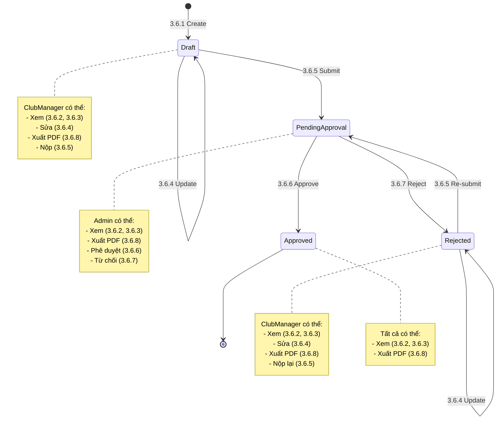
```mermaid
stateDiagram-v2
    [*] --> Draft : 3.6.1 Create
    
    Draft --> Draft : 3.6.4 Update
    Draft --> PendingApproval : 3.6.5 Submit
    
    PendingApproval --> Approved : 3.6.6 Approve
    PendingApproval --> Rejected : 3.6.7 Reject
    
    Rejected --> Rejected : 3.6.4 Update
    Rejected --> PendingApproval : 3.6.5 Re-submit
    
    Approved --> [*]
    
    note right of Draft
        ClubManager có thể:
        - Xem (3.6.2, 3.6.3)
        - Sửa (3.6.4)
        - Xuất PDF (3.6.8)
        - Nộp (3.6.5)
    end note
    
    note right of PendingApproval
        Admin có thể:
        - Xem (3.6.2, 3.6.3)
        - Xuất PDF (3.6.8)
        - Phê duyệt (3.6.6)
        - Từ chối (3.6.7)
    end note
    
    note right of Rejected
        ClubManager có thể:
        - Xem (3.6.2, 3.6.3)
        - Sửa (3.6.4)
        - Xuất PDF (3.6.8)
        - Nộp lại (3.6.5)
    end note
    
    note right of Approved
        Tất cả có thể:
        - Xem (3.6.2, 3.6.3)
        - Xuất PDF (3.6.8)
    end note
```

---

## 5. Bảng tổng hợp API Endpoints

| Chức năng | Method | Endpoint | Role | Request Body | Response |
|-----------|--------|----------|------|--------------|----------|
| 3.6.1 Create | POST | `/api/monthly-reports` | ClubManager | CreateMonthlyReportDto | MonthlyReportDto |
| 3.6.2 List | GET | `/api/monthly-reports?clubId={id}` | ClubManager, Admin | - | List~MonthlyReportListDto~ |
| 3.6.3 Detail | GET | `/api/monthly-reports/{id}` | ClubManager, Admin | - | MonthlyReportDto |
| 3.6.4 Update | PUT | `/api/monthly-reports/{id}` | ClubManager | UpdateMonthlyReportDto | MonthlyReportDto |
| 3.6.5 Submit | POST | `/api/monthly-reports/{id}/submit` | ClubManager | - | Success message |
| 3.6.6 Approve | POST | `/api/monthly-reports/{id}/approve` | Admin | - | Success message |
| 3.6.7 Reject | POST | `/api/monthly-reports/{id}/reject` | Admin | RejectMonthlyReportDto | Success message |
| 3.6.8 Export PDF | GET | `/api/monthly-reports/{id}/pdf` | ClubManager, Admin | - | PDF file |

---

## 6. Ghi chú

### Các trạng thái của Monthly Report:
- **Draft**: Báo cáo mới tạo, ClubManager có thể chỉnh sửa
- **PendingApproval**: Đã nộp, đang chờ Admin phê duyệt
- **Approved**: Đã được Admin phê duyệt
- **Rejected**: Bị Admin từ chối, ClubManager có thể chỉnh sửa và nộp lại

### Phân quyền:
- **ClubManager**: Tạo, xem, sửa, nộp, xuất PDF báo cáo của CLB mình
- **Admin**: Xem tất cả báo cáo, phê duyệt, từ chối, xuất PDF
