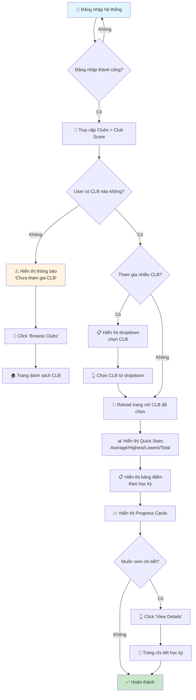
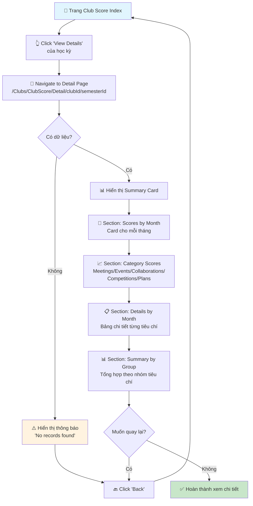
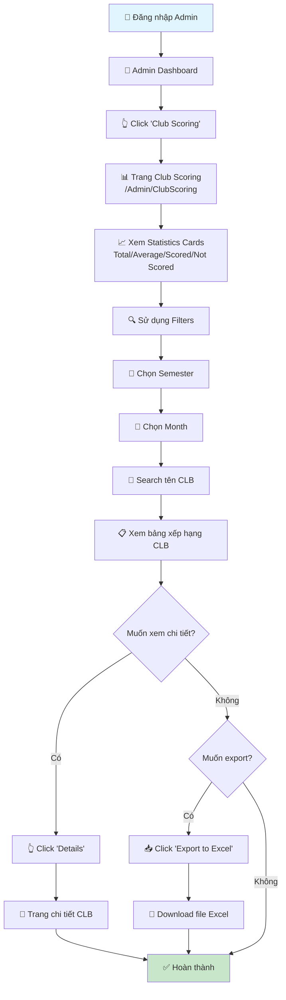
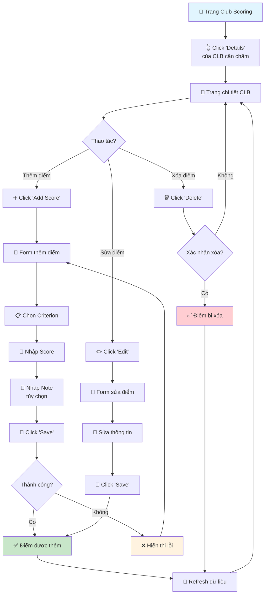
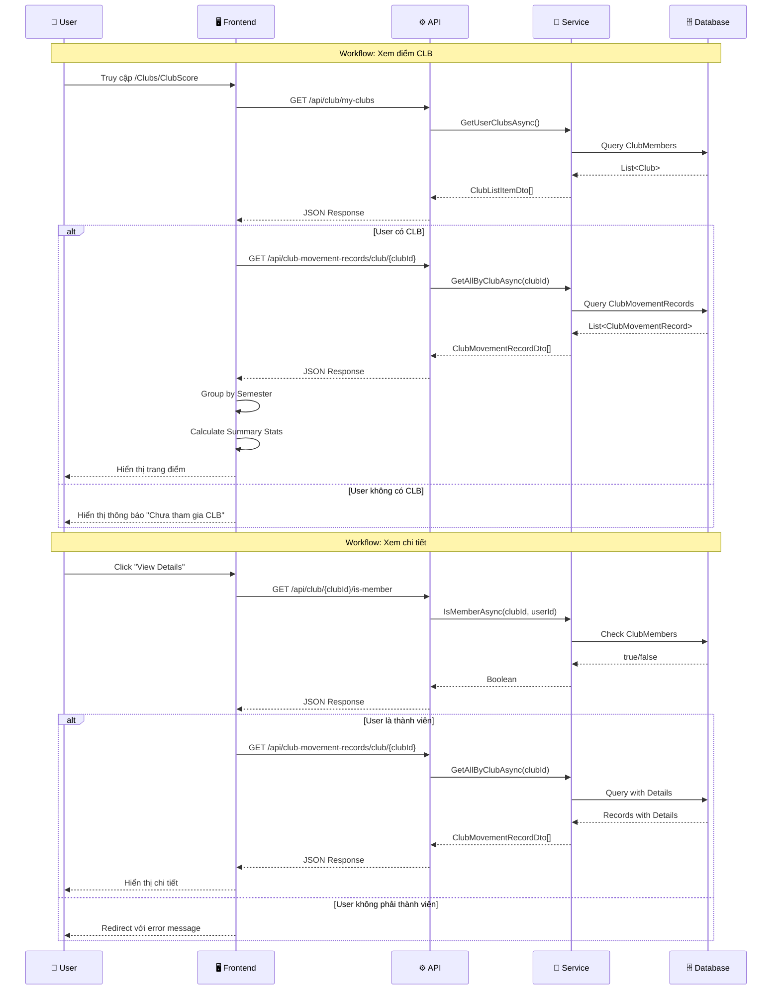

# 📊 SCORE MANAGEMENT - USER GUIDE

## Hướng dẫn sử dụng chức năng Quản lý Điểm Phong trào

---

## 📋 Mục lục

1. [Tổng quan hệ thống](#1-tổng-quan-hệ-thống)
2. [Workflow cho Club Member](#2-workflow-cho-club-member)
3. [Workflow cho Club Manager](#3-workflow-cho-club-manager)
4. [Workflow cho Admin](#4-workflow-cho-admin)
5. [Giải thích các thành phần UI](#5-giải-thích-các-thành-phần-ui)
6. [FAQ - Câu hỏi thường gặp](#6-faq---câu-hỏi-thường-gặp)

---

## 1. Tổng quan hệ thống

### 1.1 Điểm phong trào CLB (Club Movement Score)

Điểm phong trào CLB được tính dựa trên **5 hạng mục**:

| Hạng mục | Mô tả | Ví dụ |
|----------|-------|-------|
| **Meetings** | Điểm họp CLB | Họp định kỳ, họp ban chủ nhiệm |
| **Events** | Điểm tổ chức sự kiện | Workshop, seminar, hội thảo |
| **Collaborations** | Điểm hợp tác | Hợp tác với CLB khác, doanh nghiệp |
| **Competitions** | Điểm thi đấu | Tham gia/tổ chức cuộc thi |
| **Plans** | Điểm kế hoạch | Nộp kế hoạch đúng hạn |

### 1.2 Đánh giá điểm

| Mức điểm | Đánh giá | Màu hiển thị |
|----------|----------|--------------|
| ≥ 80 | Excellent (Xuất sắc) | 🟢 Xanh lá |
| 60-79 | Good (Tốt) | 🟡 Vàng |
| < 60 | Needs Improvement (Cần cải thiện) | 🔴 Đỏ |

---

## 2. Workflow cho Club Member

### 2.1 Xem điểm phong trào CLB

```
┌─────────────────────────────────────────────────────────────────┐
│                    WORKFLOW: XEM ĐIỂM CLB                       │
│                    (Dành cho Club Member)                       │
└─────────────────────────────────────────────────────────────────┘
```

#### Step 1: Đăng nhập hệ thống
1. Truy cập trang web EduXtend
2. Nhập **Email** và **Password**
3. Click **"Login"**

#### Step 2: Truy cập trang Club Score
1. Từ menu chính, click **"Clubs"**
2. Chọn **"Club Score"** hoặc truy cập trực tiếp: `/Clubs/ClubScore`

#### Step 3: Chọn CLB (nếu tham gia nhiều CLB)
1. Nếu bạn là thành viên của nhiều CLB, dropdown **"Select Club"** sẽ xuất hiện
2. Chọn CLB muốn xem điểm từ dropdown
3. Trang sẽ tự động reload với dữ liệu của CLB được chọn

#### Step 4: Xem thống kê tổng quan
Trang hiển thị 4 thẻ thống kê:
- **Average Score**: Điểm trung bình qua các học kỳ
- **Highest Score**: Điểm cao nhất
- **Lowest Score**: Điểm thấp nhất
- **Total Records**: Tổng số học kỳ đã ghi nhận

#### Step 5: Xem bảng điểm theo học kỳ
Bảng hiển thị các cột:
| Cột | Mô tả |
|-----|-------|
| Semester | Tên học kỳ |
| Total Score | Tổng điểm (/ 100) |
| Months | Số tháng đã ghi nhận |
| Criteria Achieved | Số tiêu chí đạt được |
| Evaluation | Đánh giá (Excellent/Good/Needs Improvement) |
| Last Updated | Ngày cập nhật cuối |
| Action | Nút xem chi tiết |

#### Step 6: Xem Progress Cards
- Cuộn xuống để xem **Progress by Semester**
- Mỗi card hiển thị:
  - Tên học kỳ
  - Thanh tiến độ (progress bar)
  - Tổng điểm / 100
  - Số tháng đã ghi nhận

---

### 2.2 Xem chi tiết điểm theo học kỳ

```
┌─────────────────────────────────────────────────────────────────┐
│                WORKFLOW: XEM CHI TIẾT ĐIỂM                      │
│                    (Dành cho Club Member)                       │
└─────────────────────────────────────────────────────────────────┘
```

#### Step 1: Từ trang Club Score, click "View Details"
1. Tìm học kỳ muốn xem trong bảng
2. Click nút **"View Details"** ở cột Action
3. Hoặc truy cập: `/Clubs/ClubScore/Detail/{clubId}/{semesterId}`

#### Step 2: Xem thông tin tổng quan học kỳ
Card đầu tiên hiển thị:
- **Semester Name**: Tên học kỳ
- **Club Name**: Tên CLB
- **President**: Chủ nhiệm CLB (Tên + MSSV)
- **Total Months**: Số tháng đã ghi nhận
- **Total Criteria**: Tổng số tiêu chí
- **Total Score**: Tổng điểm với progress bar

#### Step 3: Xem điểm theo tháng
Section **"Scores by Month"** hiển thị:
- Card cho mỗi tháng (January, February, ...)
- Mỗi card có:
  - Tên tháng
  - Điểm tháng đó
  - Progress bar
  - Số tiêu chí đạt được

#### Step 4: Xem điểm theo hạng mục
Section **"Total Scores by Category"** hiển thị 5 box:
- **Meetings**: Điểm họp CLB
- **Events**: Điểm sự kiện
- **Collaborations**: Điểm hợp tác
- **Competitions**: Điểm thi đấu
- **Plans**: Điểm kế hoạch

#### Step 5: Xem chi tiết từng tiêu chí
Mỗi tháng có bảng chi tiết:
| Cột | Mô tả |
|-----|-------|
| Criterion Group | Nhóm tiêu chí |
| Criterion | Tên tiêu chí cụ thể |
| Max Score | Điểm tối đa |
| Score Achieved | Điểm đạt được |
| Date Awarded | Ngày được chấm điểm |

#### Step 6: Xem tổng hợp theo nhóm tiêu chí
Section cuối **"Summary by Criterion Group"** hiển thị:
- Card cho mỗi nhóm tiêu chí
- Tổng điểm của nhóm
- Số tiêu chí đã đạt

#### Step 7: Quay lại trang tổng quan
- Click nút **"← Back"** ở góc trên phải
- Hoặc click breadcrumb navigation

---

### 2.3 Xử lý trường hợp đặc biệt

#### Trường hợp 1: Chưa tham gia CLB nào
```
┌─────────────────────────────────────────────────────────────────┐
│  ℹ️ You are not a member of any club                           │
│  Join a club to view club movement scores.                      │
│  [Browse Clubs]                                                 │
└─────────────────────────────────────────────────────────────────┘
```
**Giải pháp**: Click **"Browse Clubs"** để tìm và tham gia CLB

#### Trường hợp 2: CLB chưa có điểm
```
┌─────────────────────────────────────────────────────────────────┐
│  ℹ️ No activity scores yet                                      │
│  Club activity scores will appear here once activities are      │
│  completed and scored.                                          │
└─────────────────────────────────────────────────────────────────┘
```
**Giải pháp**: Chờ Admin chấm điểm cho CLB

---

## 3. Workflow cho Club Manager

### 3.1 Xem điểm phong trào CLB (Club Manager)

```
┌─────────────────────────────────────────────────────────────────┐
│                    WORKFLOW: XEM ĐIỂM CLB                       │
│                   (Dành cho Club Manager)                       │
└─────────────────────────────────────────────────────────────────┘
```

#### Step 1: Đăng nhập với tài khoản Club Manager
1. Truy cập trang web EduXtend
2. Đăng nhập với tài khoản có quyền Club Manager

#### Step 2: Truy cập Club Manager Dashboard
1. Từ menu, click **"Club Manager"**
2. Chọn **"Club Movement Score"**
3. Hoặc truy cập: `/ClubManager/ClubMovementScore`

#### Step 3-7: Tương tự như Club Member
(Xem mục 2.1 và 2.2)

> **Lưu ý**: Club Manager có thể xem điểm của tất cả CLB mà họ quản lý hoặc là thành viên.

---

## 4. Workflow cho Admin

### 4.1 Xem và quản lý điểm CLB

```
┌─────────────────────────────────────────────────────────────────┐
│                WORKFLOW: QUẢN LÝ ĐIỂM CLB                       │
│                      (Dành cho Admin)                           │
└─────────────────────────────────────────────────────────────────┘
```

#### Step 1: Đăng nhập với tài khoản Admin
1. Truy cập trang web EduXtend
2. Đăng nhập với tài khoản Admin

#### Step 2: Truy cập trang Club Scoring
1. Từ Admin Dashboard, click **"Club Scoring"**
2. Hoặc truy cập: `/Admin/ClubScoring`

#### Step 3: Xem thống kê tổng quan
4 thẻ thống kê hiển thị:
- **Total Clubs**: Tổng số CLB
- **Average Score**: Điểm trung bình
- **Scored Clubs**: Số CLB đã chấm điểm
- **Not Scored**: Số CLB chưa chấm điểm

#### Step 4: Lọc dữ liệu
Sử dụng các bộ lọc:
| Bộ lọc | Mô tả |
|--------|-------|
| **Semester** | Chọn học kỳ |
| **Month** | Chọn tháng |
| **Search** | Tìm kiếm theo tên CLB |

1. Chọn **Semester** từ dropdown
2. Chọn **Month** từ dropdown
3. Nhập tên CLB vào ô **Search** (tùy chọn)
4. Dữ liệu tự động cập nhật

#### Step 5: Xem bảng xếp hạng CLB
Bảng hiển thị các cột:
| Cột | Mô tả |
|-----|-------|
| # | Số thứ tự |
| Rank | Xếp hạng (🥇🥈🥉 cho top 3) |
| Club Name | Tên CLB |
| Meetings | Điểm họp |
| Events | Điểm sự kiện |
| Collaborations | Điểm hợp tác |
| Competitions | Điểm thi đấu |
| Plans | Điểm kế hoạch |
| Total Score | Tổng điểm |
| Actions | Nút xem chi tiết |

#### Step 6: Xem chi tiết điểm CLB
1. Click **"Details"** ở cột Actions
2. Trang chi tiết hiển thị:
   - Thông tin CLB
   - Điểm theo từng tiêu chí
   - Lịch sử chấm điểm

#### Step 7: Export dữ liệu
1. Click nút **"Export to Excel"** ở góc trên phải
2. File Excel sẽ được tải xuống với dữ liệu hiện tại

---

### 4.2 Chấm điểm thủ công cho CLB

```
┌─────────────────────────────────────────────────────────────────┐
│              WORKFLOW: CHẤM ĐIỂM THỦ CÔNG                       │
│                      (Dành cho Admin)                           │
└─────────────────────────────────────────────────────────────────┘
```

#### Step 1: Truy cập trang chi tiết CLB
1. Từ trang Club Scoring, click **"Details"** của CLB cần chấm điểm

#### Step 2: Thêm điểm mới
1. Click nút **"Add Score"** hoặc **"+"**
2. Chọn **Criterion** (tiêu chí chấm điểm)
3. Nhập **Score** (điểm số)
4. Nhập **Note** (ghi chú - tùy chọn)
5. Click **"Save"**

#### Step 3: Sửa điểm đã chấm
1. Tìm điểm cần sửa trong bảng
2. Click nút **"Edit"** (biểu tượng bút chì)
3. Sửa thông tin
4. Click **"Save"**

#### Step 4: Xóa điểm
1. Tìm điểm cần xóa
2. Click nút **"Delete"** (biểu tượng thùng rác)
3. Xác nhận xóa

> **Lưu ý**: Chỉ có thể sửa/xóa điểm **Manual** (chấm thủ công). Điểm **Auto** (tự động) không thể sửa.

---

## 5. Giải thích các thành phần UI

### 5.1 Quick Stats Cards

```
┌──────────────────┐ ┌──────────────────┐ ┌──────────────────┐ ┌──────────────────┐
│  Average Score   │ │  Highest Score   │ │  Lowest Score    │ │  Total Records   │
│      75.5        │ │      92.0        │ │      58.0        │ │        5         │
│   📈 Graph Up    │ │   ⬆️ Arrow Up    │ │   ⬇️ Arrow Down  │ │   📅 Calendar    │
└──────────────────┘ └──────────────────┘ └──────────────────┘ └──────────────────┘
```

### 5.2 Semester Table

```
┌─────────────┬─────────────┬────────┬──────────────┬─────────────┬──────────────┬─────────────┐
│  Semester   │ Total Score │ Months │   Criteria   │ Evaluation  │ Last Updated │   Action    │
├─────────────┼─────────────┼────────┼──────────────┼─────────────┼──────────────┼─────────────┤
│ Fall 2024   │   85.0/100  │   4    │      12      │  Excellent  │  15/11/2024  │ View Details│
│ Spring 2024 │   72.5/100  │   5    │      10      │    Good     │  30/06/2024  │ View Details│
│ Fall 2023   │   55.0/100  │   3    │       8      │   Needs...  │  20/12/2023  │ View Details│
└─────────────┴─────────────┴────────┴──────────────┴─────────────┴──────────────┴─────────────┘
```

### 5.3 Progress Cards

```
┌─────────────────────────────────┐
│  Fall 2024              85.0%  │
│  ████████████████░░░░░░░░░░░░  │
│  Total Score: 85.0 / 100       │
│  4 months recorded             │
└─────────────────────────────────┘
```

### 5.4 Category Scores

```
┌──────────┐ ┌──────────┐ ┌──────────────┐ ┌──────────────┐ ┌──────────┐
│ Meetings │ │  Events  │ │Collaborations│ │ Competitions │ │  Plans   │
│   15.0   │ │   25.0   │ │     10.0     │ │     20.0     │ │   15.0   │
└──────────┘ └──────────┘ └──────────────┘ └──────────────┘ └──────────┘
```

### 5.5 Criterion Details Table

```
┌────────────────┬─────────────────────────────┬───────────┬───────────────┬──────────────┐
│ Criterion Group│         Criterion           │ Max Score │ Score Achieved│ Date Awarded │
├────────────────┼─────────────────────────────┼───────────┼───────────────┼──────────────┤
│    Events      │ Tổ chức workshop            │    10     │      8.0      │  10/11/2024  │
│    Events      │ Tổ chức seminar             │    15     │     12.0      │  15/11/2024  │
│   Meetings     │ Họp định kỳ tháng 11        │     5     │      5.0      │  20/11/2024  │
└────────────────┴─────────────────────────────┴───────────┴───────────────┴──────────────┘
```

---

## 6. FAQ - Câu hỏi thường gặp

### Q1: Tại sao tôi không thấy điểm CLB của mình?
**A**: Có thể do:
- Bạn chưa là thành viên active của CLB
- CLB chưa được Admin chấm điểm
- Học kỳ hiện tại chưa có dữ liệu

### Q2: Điểm được cập nhật khi nào?
**A**: Điểm được cập nhật khi:
- Admin chấm điểm thủ công
- Hệ thống tự động chấm điểm (chạy lúc 02:00 sáng hàng ngày)

### Q3: Tôi có thể xem điểm của CLB khác không?
**A**: Không. Bạn chỉ có thể xem điểm của CLB mà bạn là thành viên active.

### Q4: Điểm tối đa là bao nhiêu?
**A**: Tổng điểm tối đa là **100 điểm** cho mỗi học kỳ.

### Q5: Làm sao để cải thiện điểm CLB?
**A**: CLB có thể cải thiện điểm bằng cách:
- Tổ chức nhiều hoạt động (Events)
- Họp định kỳ đầy đủ (Meetings)
- Hợp tác với các CLB/tổ chức khác (Collaborations)
- Tham gia/tổ chức cuộc thi (Competitions)
- Nộp kế hoạch đúng hạn (Plans)

### Q6: Tại sao điểm của tôi bị giới hạn?
**A**: Mỗi hạng mục có điểm tối đa riêng. Khi vượt quá, điểm sẽ bị cap lại.

---

## 📞 Hỗ trợ

Nếu gặp vấn đề, vui lòng liên hệ:
- **Email**: support@eduxend.edu.vn
- **Hotline**: 1900-xxxx

---

*Tài liệu được cập nhật: Tháng 12/2024*


---

## 📊 Workflow Diagrams

### Diagram 1: Club Member - Xem điểm CLB



### Diagram 2: Club Member - Xem chi tiết điểm học kỳ



### Diagram 3: Admin - Quản lý điểm CLB



### Diagram 4: Admin - Chấm điểm thủ công



### Diagram 5: Tổng quan hệ thống Score Management

```mermaid
flowchart TB
    subgraph Users["👥 Users"]
        CM[Club Member]
        CMgr[Club Manager]
        Admin[Admin]
    end
    
    subgraph Frontend["🖥️ Frontend - WebFE"]
        subgraph MemberPages["Member Pages"]
            CS1[/Clubs/ClubScore/Index]
            CS2[/Clubs/ClubScore/Detail]
        end
        
        subgraph ManagerPages["Manager Pages"]
            CMS1[/ClubManager/ClubMovementScore/Index]
            CMS2[/ClubManager/ClubMovementScore/Detail]
        end
        
        subgraph AdminPages["Admin Pages"]
            ACS[/Admin/ClubScoring/Index]
            ACSD[/Admin/ClubScoring/Detail]
        end
    end
    
    subgraph Backend["⚙️ Backend - WebAPI"]
        API1[GET /api/club/my-clubs]
        API2[GET /api/club-movement-records/club/clubId]
        API3[GET /api/club/clubId/is-member]
        API4[POST /api/club-movement-records/manual-score]
    end
    
    subgraph Services["🔧 Services"]
        SVC1[ClubScoringService]
        SVC2[ClubService]
    end
    
    subgraph Database["🗄️ Database"]
        DB1[(ClubMovementRecords)]
        DB2[(ClubMembers)]
        DB3[(MovementCriteria)]
    end
    
    CM --> CS1
    CM --> CS2
    CMgr --> CMS1
    CMgr --> CMS2
    Admin --> ACS
    Admin --> ACSD
    
    CS1 --> API1
    CS1 --> API2
    CS2 --> API2
    CS2 --> API3
    
    CMS1 --> API1
    CMS1 --> API2
    CMS2 --> API2
    CMS2 --> API3
    
    ACS --> API2
    ACSD --> API4
    
    API1 --> SVC2
    API2 --> SVC1
    API3 --> SVC2
    API4 --> SVC1
    
    SVC1 --> DB1
    SVC1 --> DB3
    SVC2 --> DB2
    
    style Users fill:#e3f2fd
    style Frontend fill:#f3e5f5
    style Backend fill:#e8f5e9
    style Services fill:#fff3e0
    style Database fill:#fce4ec
```

### Diagram 6: Luồng dữ liệu điểm CLB



---

## 📝 Ghi chú kỹ thuật

### API Endpoints sử dụng

| Endpoint | Method | Mô tả | Quyền truy cập |
|----------|--------|-------|----------------|
| `/api/club/my-clubs` | GET | Lấy danh sách CLB của user | Authenticated |
| `/api/club/{clubId}/is-member` | GET | Kiểm tra membership | Authenticated |
| `/api/club-movement-records/club/{clubId}` | GET | Lấy điểm CLB | Member/Admin |
| `/api/club-movement-records/manual-score` | POST | Thêm điểm thủ công | Admin |

### URL Routes

| Route | Trang | Người dùng |
|-------|-------|------------|
| `/Clubs/ClubScore` | Xem điểm CLB | Club Member |
| `/Clubs/ClubScore/Detail/{clubId}/{semesterId}` | Chi tiết điểm | Club Member |
| `/ClubManager/ClubMovementScore` | Xem điểm CLB | Club Manager |
| `/ClubManager/ClubMovementScore/Detail/{clubId}/{semesterId}` | Chi tiết điểm | Club Manager |
| `/Admin/ClubScoring` | Quản lý điểm | Admin |
| `/Admin/ClubScoring/Detail` | Chi tiết + chấm điểm | Admin |

---

*Tài liệu hoàn thành: Tháng 12/2024*
